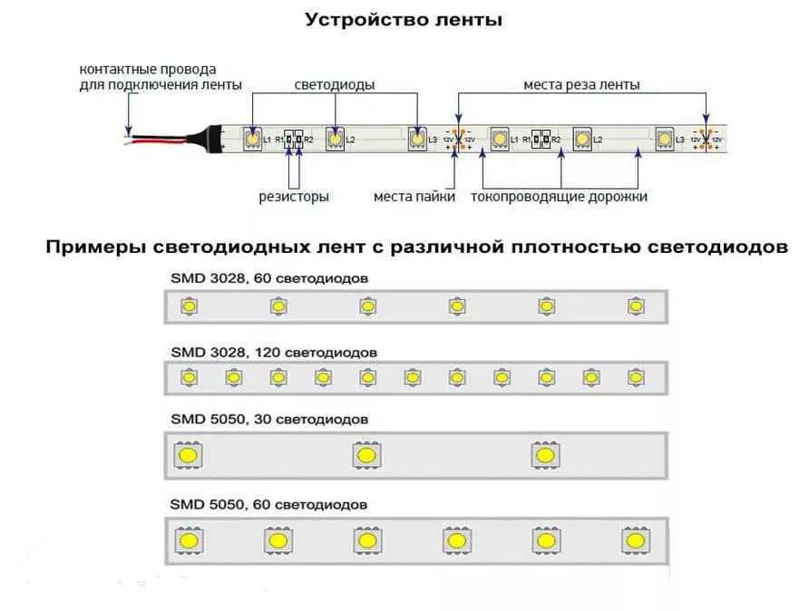

Программирование светодиодной ленты
-----------------------------------

Общие сведения
~~~~~~~~~~~~~~

RGB светодиодные ленты устроены аналогично одноцветным лентам и RGB светодиодам: в 12 Вольтовой ленте светодиоды каждого цвета соединяются по три штуки с токоограничивающим резистором и образуют сегмент ленты, далее эти сегменты подключаются параллельно.    

Также лента имеет общий вывод со всех цветов, в большинстве случаев это общий анод.

Подключение светодиодной ленты
~~~~~~~~~~~~~~~~~~~~~~~~~~~~~~

Подключение происходит также как и с остальными модулями,  подключаемыми в ``силовой ключ DXL``: красный провод к 5V, черный к GND.

Программирование
~~~~~~~~~~~~~~~~

::

  #include <JsAr.h>	// Подключение библиотеки для работы с платой ESP. #include <DxlMaster.h>		// Подключение библиотеки для работы с DXL-устройствами.
  DynamixelDevice ledstrip(0x0C);

  void setup() {
    JsAr.begin();	// Начинаем работу с платой ESP. Без этой строчки ничего работать не будет!
    DxlMaster.begin(57600);	// Начинаем работу с DXL-устройствами.
    ledstrip.init();	// Инициализируем кнопку и силовой ключ. 
  } 

  void loop() {
    ledstrip.write(28, 255);	// Непосредственное открытие ключа записью значения 255 в нужный регистр.
  }

