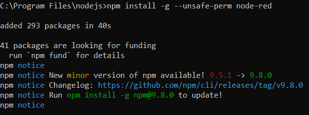
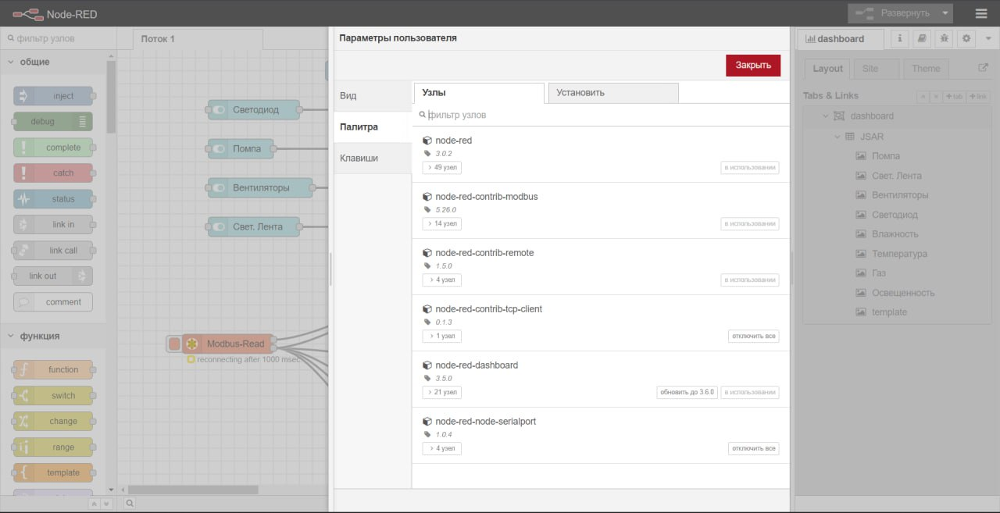
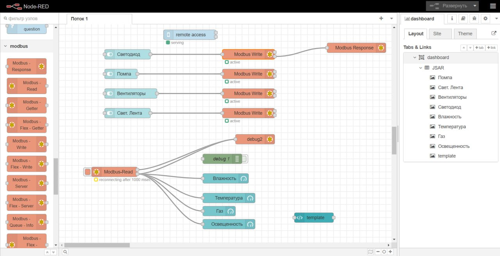
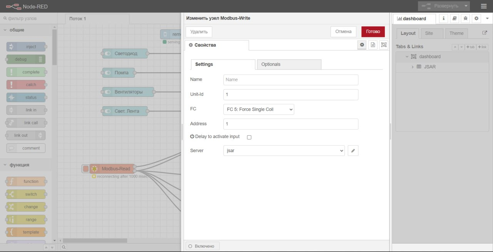
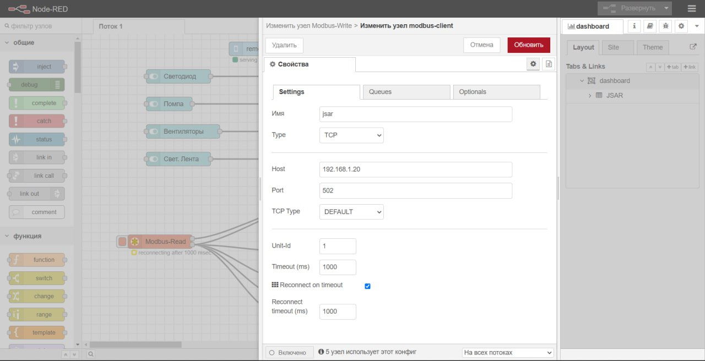
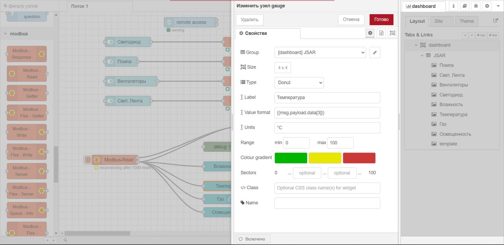
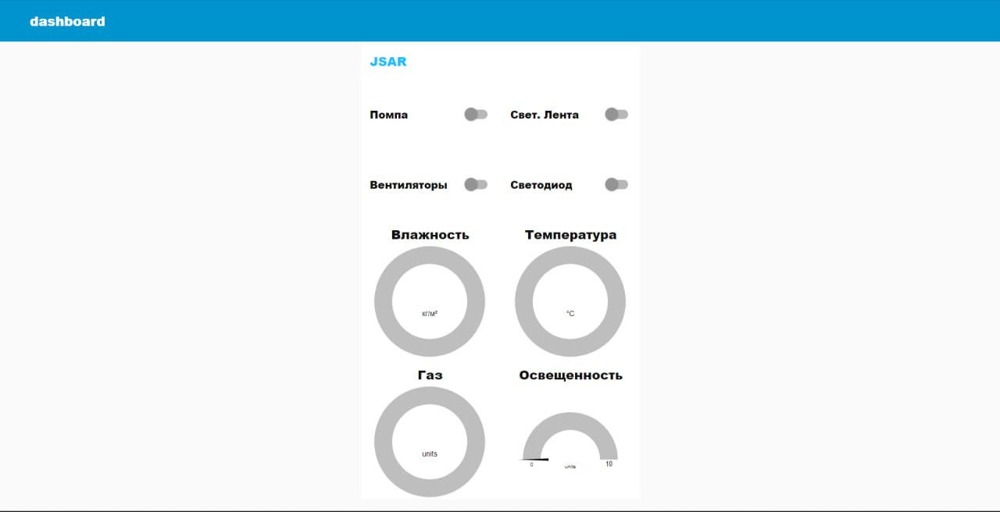

Настройка Node-red
==================

Установка
---------

1. Для установки Node-RED перейдём на официальный сайт продукта: ``https://nodered.org/``

2. На открывшейся странице нажмём на кнопку “Get Started”

3. Выберем вариант “Run locally” , “Getting started”

4. В открывшейся странице выберем вариант “Running locally” чтобы установить Node-RED на свой ПК

5. Выберем вариант установки для Windows или для любой другой операционной системы

Далее, следуя указаниям в инструкции по установке перейдите на страницу ``https://nodejs.org/en`` и скачайте .msi файл. После успешной установки вы увидите следующее сообщение. Кроме того, откроется консоль установки дополнительных инструментов Node.js

.. figure:: images/1.png
       :width: 60%
       :align: center
       :alt: установка

Откройте cmd, перейдите в каталог nodejs. Запустите процесс установки Node-RED. Для
этого введите следующий запрос::

  npm install -g --unsafe-perm node-red

Для запуска Node-RED введите команду:: 

  node-red

.. figure:: images/3.png
       :width: 60%
       :align: center
       :alt: установка

По умолчанию Node-RED запускается на адресе ``http://localhost:1880``. Откройте свой веббраузер и перейдите по этому адресу. Вы можете создавать свои потоки (flows) в Node-RED, используя визуальный интерфейс. Для этого нажмите на кнопку «Create a New Flow» на главной странице Node-RED. Для дополнительной настройки вы можете установить узлы (``nodes``) и плагины (``plugins``) Node-RED, используя менеджер пакетов ``npm``. Например, чтобы установить узел для работы с базой данных MongoDB, выполните команду::

  npm install node-red-contrib-mongodb

Изучение интерфейса Node-RED
----------------------------

Интерфейс Node-RED представляет собой веб-приложение, которое можно открыть в любом браузере.

Главная страница интерфейса содержит панель инструментов слева и рабочее пространство, где вы можете создавать и редактировать потоки данных (flows). В панели инструментов находятся узлы (nodes), которые могут быть перетаскиваны в рабочее пространство и связаны проводами (wires) для передачи данных между ними. Узлы могут выполнять различные функции, например, считывать данные из базы данных, обрабатывать данные, отправлять данные на другие устройства и т.д.

В меню также есть вкладка «Debug», где можно просмотреть данные, передаваемые между узлами в реальном времени.

.. figure:: images/4.png
       :width: 100%
       :align: center
       :alt: Node-RED

Подключение к Agrolab GH
---------------------

Установка узлов Modbus в Node-RED
~~~~~~~~~~~~~~~~~~~~~~~~~~~~~~~~~

В Node-RED можно установить несколько узлов Modbus, которые позволяют связываться с устройствами, использующими протокол Modbus. Вот пошаговая инструкция по установке узлов Modbus в Node-RED:

1. Откройте Node-RED, если он еще не запущен.

2. Нажмите на иконку «Меню» (три горизонтальные линии) в правом верхнем углу экрана и выберите ``Manage palette``.

3. В меню «Manage palette» выберите вкладку «Install».

4. В поле поиска введите следующие пакетов узлов Modbus и нажмите кнопку «Install» рядом с ним:
::
  node-red-contrib-modbus
  node-red-contrib-modbustcp
  node-red-contrib-modbus-flex-getters

5. Дождитесь завершения установки.

6. После установки узлов Modbus перезапустите Node-RED, чтобы изменения вступили в силу.

Настройка параметров подключения узла
~~~~~~~~~~~~~~~~~~~~~~~~~~~~~~~~~~~~~

Настройка параметров подключения для узла Modbus в Node-RED может немного отличаться в зависимости от узла, который вы используете. Однако, общие шаги по настройке параметров подключения для узла Modbus включают следующее:

1. Откройте Node-RED и перетащите узел Modbus на рабочее пространство.

2. Настройте имя узла на ваше усмотрение, чтобы легко идентифицировать узел Modbus в вашем потоке.

3. Введите IP-адрес сервера, с которым вы хотите связаться, в поле ``IP Address``.

4. Введите номер порта, используемого для связи с сервером, в поле ``Port``.

5. Выберите тип устройства, с которым вы хотите связаться, в поле ``Unit ID``. Это может быть, например, контроллер, датчик, привод или другое устройство.

6. Выберите функцию Modbus, необходимую для вашей конкретной задачи, в поле ``Function Code``. Например, это может быть функция чтения регистра ``(Read Holding Register)``, записи в регистр ``(Write Holding Register)`` или другая функция.

7. Если требуется, введите адрес регистра или другие параметры, связанные с выбранной функцией, в соответствующие поля.

8. Сохраните настройки узла Modbus и подключите его проводами (wires) к другим узлам, чтобы передавать сообщения и данные между ними. Обратите внимание, что параметры подключения для узла Modbus в Node-RED могут различаться в зависимости от узла, который вы используете, и от типа устройства, с которым вы хотите связаться.

9. Результат работы можно увидеть перейдя во вкладку Dashboard, или по ссылке ``http://localhost:1880/ui``

