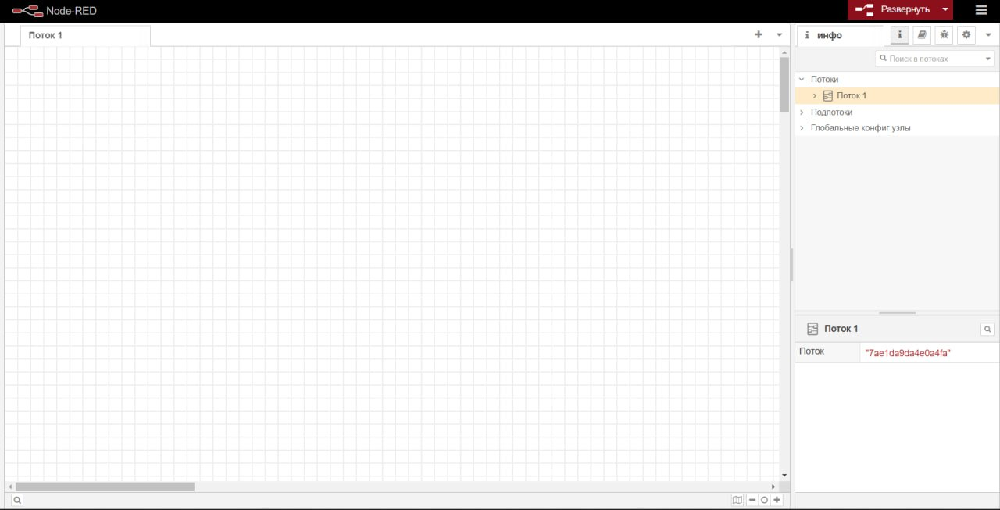
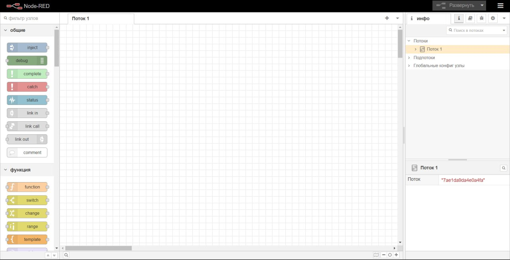
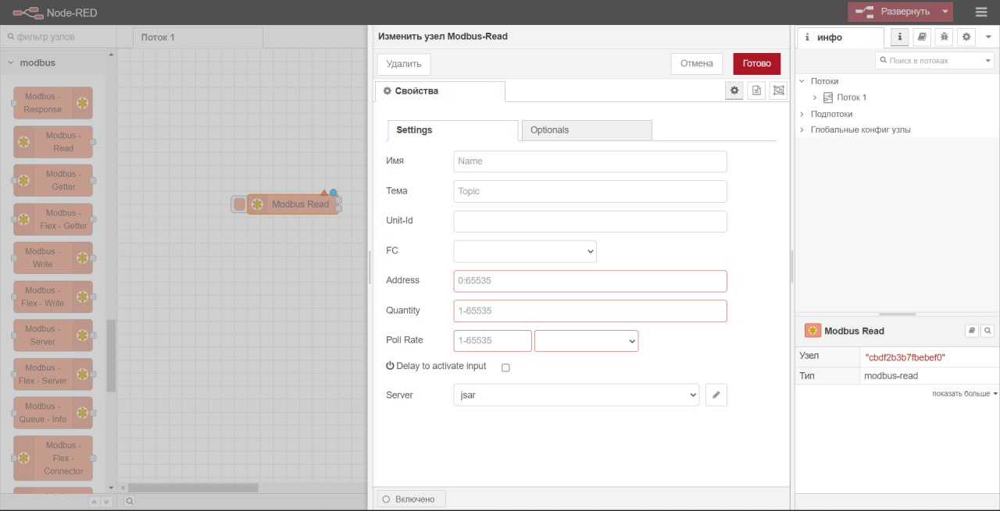
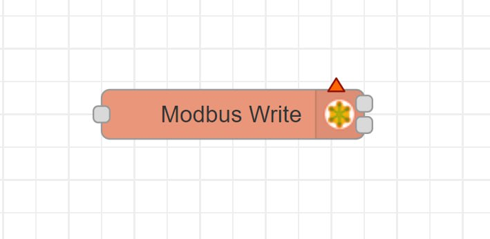

Изучение интерфейса Node-RED
----------------------------

Node-Red - это инструмент, который позволяет вам легко создавать программы, используя блоки визуального программирования. Тут мы изучим интерфейс Node-Red

Начало работы
~~~~~~~~~~~~~

После установки Node-Red вам будет доступен веб-интерфейс, который вы можете открыть в вашем браузере, перейдя по адресу http://localhost:1880. При первом запуске Node-Red вас встретит стартовый экран, на котором вы сможете начать создавать свою первую программу.

Область работы
~~~~~~~~~~~~~~

Область работы находится в центре интерфейса и представляет собой пустой лист бумаги, на котором вы можете размещать узлы и соединения между ними. Щелкните правой кнопкой мыши на листе бумаги, чтобы открыть контекстное меню и добавить новый узел или создать новое соединение.
(вставить фото области работы)

Палитра узлов
~~~~~~~~~~~~~

Палитра узлов находится слева от области работы и содержит все доступные узлы, которые вы можете использовать в своей программе. Наведите курсор на узел, чтобы увидеть, как он выглядит, и щелкните по нему, чтобы добавить его на область работы.
(вставить фото палитры узлов)

Панель свойств
~~~~~~~~~~~~~~

Панель свойств находится в правой части интерфейса и позволяет вам настраивать свойства узлов, которые вы размещаете на области работы. Щелкните по узлу, чтобы открыть панель свойств и настроить его параметры.
(вставить фото панели свойств)

       
Описание узлов которы будут использованы:

1. Modbus-Write

Узел Modbus TCP/Serial запускается с помощью msg.payload для записи.

Соединяется с сервером Modbus TCP или последовательным для записи катушек/регистров при каждом входящем сообщении.

В настоящее время поддерживаются следующие коды функций:
- FC 5: Принудительная запись одной катушки

- FC 6: Установка одного регистра

- FC 15: Принудительная запись нескольких катушек

- FC 16: Установка нескольких регистров

Выберите код функции (FC) из выпадающего списка, выберите стартовый адрес катушки/регистра (0:65535) и количество записей. Выберите или отредактируйте конфигурацию сервера Modbus TCP/serial, указав сервер для подключения.

Unit-Id (0..255 tcp | 0..247 serial) - оставьте пустым, в противном случае он переопределит значение Unit-ID по умолчанию в клиентской конфигурации

Для FC 5 значение msg.payload должно быть 1 или 0 или true или false. Для FC 15 значение msg.payload должно быть массивом[] из разделенных запятыми значений true или false каждый. Для FC 6 значение msg.payload должно быть одним числом в диапазоне 0:65535. Для FC 16 значение msg.payload должно быть массивом[] из разделенных запятыми числовых значений в диапазоне 0:65535 каждый.

Выход 1: все предоставленные данные, модбас ответ в виде буфера, входящее сообщение

Выход 2: модбас ответ в виде буфера, все предоставленные данные, входящее сообщение

2. 