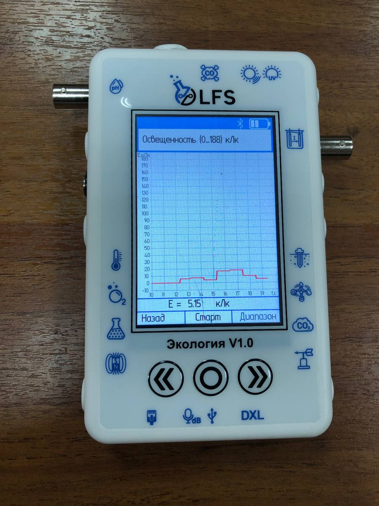

Датчик освещенности
-------------------

Датчики света — это электронные устройства, которые обнаруживают и измеряют интенсивность света в непосредственной близости от них. Они имеют широкий спектр применения в различных отраслях, включая автомобилестроение, бытовую электронику, промышленную автоматизацию и системы умного дома. PolusLab, известная технологическая компания, разработала передовой датчик освещенности, который обеспечивает исключительную точность, надежность и эффективность.

Принцип работы:
~~~~~~~~~~~~~~~

Датчик света «PolusLab» использует чувствительный механизм на основе фотодиода. ``Фотодиоды`` — это полупроводниковые устройства, преобразующие световую энергию в электрический ток. При воздействии света фотодиод генерирует ток, пропорциональный интенсивности падающего света. Схема датчика освещенности усиливает этот ток и преобразует его в ``сигнал напряжения``, который можно дополнительно обрабатывать для различных приложений.

Основные характеристики:
~~~~~~~~~~~~~~~~~~~~~~~~

- Диапазон чувствительности: от 0,01 до 100 000 люкс (настраивается)

- Спектральный отклик: от 380 нм до 780 нм

- Напряжение питания: от 2,7 В до 5,5 В

- Выход: аналоговое напряжение, цифровой выход (настраиваемый)

- Пакет: Компактный пакет для поверхностного монтажа

- Диапазон рабочих температур: от -40°C до 85°C

- Время отклика: < 10 мс

