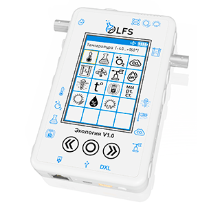
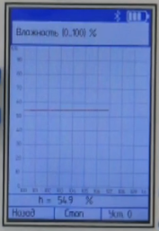

Обзор блока PolusLab
--------------------

Общая информация
~~~~~~~~~~~~~~~~

Цифровые лаборатории, представляют собой комплекты, выполненные на базе многофункциональных устройств регистрации и сбора данных ``LFS``, содержащих встроенные сенсорные устройства, подключаемые внешние датчики и цифровые интерфейсы для подключения внешних устройств, в том числе для коммуникации с внешними программируемыми контроллерами. 

Такое устройства блока позволяет использовать лабораторию как модуль робототехнической системы, в обязанности которой входит жесткий мониторинг таких состояний среды как относительная ``влажность``, ``pH``, ``атмосферное давление`` и т.п.

Беспроводной мультидатчик LFS представляет собой многофункциональное устройство регистрации и сбора данных. Он оснащен цветным сенсорным экраном для отображения числовой и графической информации о результатах измерений.

Для передачи результатов измерений на внешние ПК или мобильные устройства можно применить ``беспроводной протокол Bluetooth``. 

Состав комплекта
~~~~~~~~~~~~~~~~

Рассматриваемый комплект ``Экология v1.0`` включает в себя набор датчиков:

1. Датчик атмосферного давления;

2. Датчик освещенности (люксметр);

3. Датчик относительной влажности;

4. Датчик УФ излучения и ИК излучения;

5. Датчик температуры воздуха;

6. Датчик температуры;

7. Датчик pH;

8. Датчик нитрат-ионов;

9. Датчик хлорид-ионов;

10. Электрод сравнения;

11. Датчик электрической проводимости;

12. Датчик влажности почвы;

13. Датчик мутности и оптической плотности (колориметр);

14. Датчик содержания СО;

15. Датчик звука.

На блоке расположено 16 разъемов:: 

    Левый бок:
    “F-коннектор”, Jack 5.5 и четыре Jack 3.5. 
    Правый бок:
    “F-коннектор” и четыре Jack 3.5. 
    Верх:
    Jack 3.5 и оптический порт для датчиков (б) и (г).
    Низ:
    Сетевой порт, mini USB и MX-5264-03. (Также здесь расположен микрофон)

Каждый разъем предназначен только под определенный датчик, а потому они обозначены условными значками с лицевой стороны. На ней же расположены сенсорный экран и ``три кнопки управления``.

Управление блоком и вывод данных
~~~~~~~~~~~~~~~~~~~~~~~~~~~~~~~~

Управление датчиками может осуществляться различными путями. 

Сам блок уже является компьютером, способным вывести пользователю данные, полученные с подключенного оборудования на сенсорный экран. Для этого достаточно включить блок и выбрать на экране ``датчик`` (который конечно же должен быть заранее включён в соответствующий ему разъем). Тогда после нажатия кнопки старт блок начнет строить график измерений и выводить мгновенное значение в режиме ``реального времени``. 

Блок и управляющая плата
~~~~~~~~~~~~~~~~~~~~~~~~

Наиболее трудный, но при этом универсальный метод снятия информации может быть реализован через подключение MX-5264-03 порт. Подключив через шину по протоколу DXL плату управления робототехнической системы, можно сделать цифровую лабораторию дополнительными или даже основными органами чувств робототехнического аппарата. Не совсем рационально делать это для коммерческой продукции, однако, на этапе проектирования и при обслуживании или проверки конечной продукции этот инструмент может оказаться незаменим.

Наш пример применения блока
~~~~~~~~~~~~~~~~~~~~~~~~~~~

У нас в доступе для исследования есть блок “Экология V1.0”. Применяться он будет в качестве средства ``мониторинга состояния среды Agrolab GH`` с автоматизированной системой климат контроля (температура, состав атмосферы, состав почвы, освещенность и др.). Так как участие человека планируется минимальным, а система по своей сути представляет робота, то наиболее подходящий метод снятия информации – протокол DXL. Возможности цифровой лаборатории позволяют осуществить:

- создание необходимой прошивки для платы в самом начале проекта;

- проверку достаточности используемых методов наблюдения за средой, калибровку и подбор необходимых настроек датчиков;

- проверку возможностей готовой Agrolab GH до установки постоянных датчиков;

- долгосрочный полевой эксперимент с возможностью удаленного наблюдения.

- сверку результатов измерений на заключительном этапе сборки проекта путем дублирования датчиков и средств обработки информации.  

**Чтение данных с датчиков PolusLab**

Этот код и используется для управления и получения данных с датчиков PolusLab. Вот его функции, подробно описанные по пунктам:

1. Подключение библиотек: Включение библиотек DxlMaster2 (Dynamixel) для управления Dynamixel устройствами и JsAr для работы с Ардуино.

2. Определение констант и переменных:

- ``LFS_TEMPERATURE_ID``, ``LFS_CTRL_MEASURE_START_STOP_REG``, ``LFS_SENSOR_EN_REG`` и ``LFS_DATA_REG`` определены как адреса регистров для идентификации температуры, контроля измерений, включения датчика и данных датчика соответственно.

- ``LFS_ADDRESS`` - адрес устройства.

- dynamixel_baudrate и serial_baudrate определяют скорость передачи данных для Dynamixel и Serial соответственно.

- Используется объект DynamixelDevice с именем "device."

- Создается DynamixelStatus с именем "status."

3. Функция setup инициализирует настройки и связь:

- Инициализация JsAr с вызовом ``JsAr.begin()``.

- Инициализация Dynamixel с ``DxlMaster.begin()`` и установка таймаута.

- Инициализация Serial с вызовом ``Serial.begin()``.

- Установка протокола версии для устройства с вызовом ``device.protocolVersion(2)``.

- Проверка связи с устройством, отправка ping и вывод состояния на Serial.

- Остановка измерений, очистка списка датчиков, добавление датчика температуры в список, и запуск измерений с использованием команд ``write`` и задержек между ними.

4. Функция loop выполняется постоянно и считывает температуру:

- Записывает данные с датчика PolusLab в переменную data с помощью вызова ``device.read()``.

- Выводит данные о температуре на Serial, предварительно преобразовав значение в градусы Цельсия.

- Задает задержку в 3 секунды перед следующим считыванием данных.

В общем, этот код инициализирует и настраивает связь с датчиками через Dynamixel, считывает данные и выводит информацию на Serial::
   
    #include <DxlMaster2.h>
    #include <JsAr.h>

    #define LFS_TEMPERATURE_ID 220

    #define LFS_CTRL_MEASURE_START_STOP_REG 24  
    #define LFS_SENSOR_EN_REG 60
    #define LFS_DATA_REG 80

    #define LFS_ADDRESS 206

    DynamixelDevice device(LFS_ADDRESS);

    const unsigned long dynamixel_baudrate = 115200;
    const unsigned long serial_baudrate = 115200;

    DynamixelStatus status = 0; 

    void setup() {
        JsAr.begin();
        DxlMaster.begin(dynamixel_baudrate);
        DxlMaster.setTimeOut(10);
        Serial.begin(serial_baudrate);
        device.protocolVersion(2);

        status = device.ping(); 
        if (status == DYN_STATUS_OK)
            Serial.println("Ping status: Ok!");
        else
            Serial.println("Ping status: Err!");

        uint16_t sensors_en_buf[10] = {0};
        device.write(LFS_CTRL_MEASURE_START_STOP_REG, 0);
        delay(500);
        device.write(LFS_SENSOR_EN_REG, 20, (uint8_t*) sensors_en_buf);
        delay(500);
        sensors_en_buf[0] = LFS_TEMPERATURE_ID;
        device.write(LFS_SENSOR_EN_REG, 20, (uint8_t*) sensors_en_buf);
        delay(500);
        device.write(LFS_CTRL_MEASURE_START_STOP_REG, 1);
        delay(500);
    }

    void loop() {
        uint16_t data = 0;
        device.read(LFS_DATA_REG, data); 
        Serial.println("temperature = " + String(data/10));
        delay(3000);
    }
