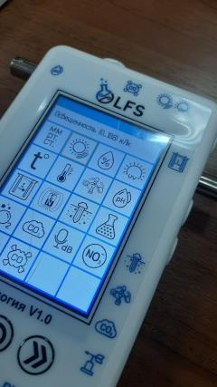
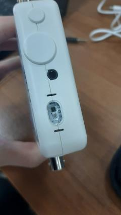
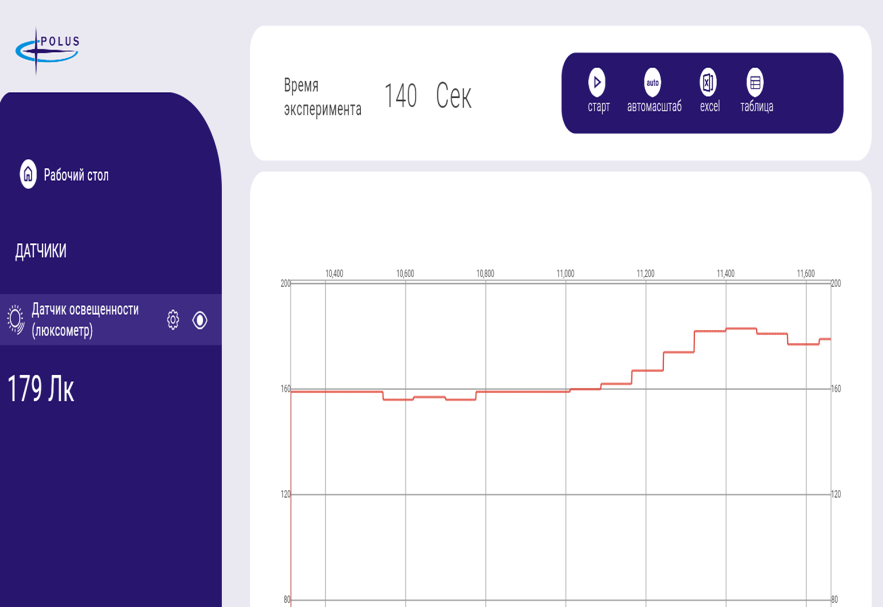
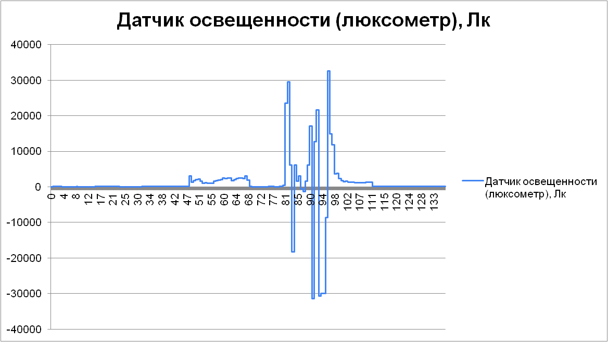

Использование веб интерфейса
----------------------------

Возможности предоставляющие веб-интерфейс
~~~~~~~~~~~~~~~~~~~~~~~~~~~~~~~~~~~~~~~~~

Вот некоторые из возможностей, которые предоставляет веб-интерфейс PolusLab:

1. ``Мониторинг и управление параметрами окружающей среды:`` Веб-интерфейс PolusLab позволяет мониторить и управлять параметрами окружающей среды в Agrolab GH, такими как температура, влажность и освещенность.

2. ``Управление системами полива и удобрения:`` С помощью веб-интерфейса PolusLab можно управлять системами полива и удобрения, включая назначение расписания полива и дозировку удобрений.

3. ``Мониторинг состояния растений:`` Веб-интерфейс PolusLab позволяет мониторить состояние растений в Agrolab GH, включая их рост, здоровье и физические характеристики.

4. ``Управление освещением:`` Веб-интерфейс PolusLab позволяет управлять системами освещения в Agrolab GH, включая назначение расписания освещения и регулировку его интенсивности.

5. ``Отчетность и аналитика:`` Веб-интерфейс PolusLab предоставляет отчеты и аналитику по производительности Agrolab GH, включая данные о росте растений, использовании ресурсов и эффективности систем управления.

6. ``Управление устройствами удаленно:`` Веб-интерфейс PolusLab позволяет управлять устройствами Agrolab GH удаленно, что позволяет управлять из любой точки мира с доступом в Интернет.

7. ``Настраиваемость:`` Веб-интерфейс PolusLab настраиваем и может быть адаптирован под конкретные потребности пользователя, что обеспечивает максимальную гибкость и удобство использования.

Порядок действий:
~~~~~~~~~~~~~~~~~

Для начала работы с веб-интерфейсом PolusLab вам потребуется msi файл программы.

1. Запустите .msi файл

2. Нажмите кнопку «Начать»

3. Выберите тип подключения к устройствам: Bluetooth или по USB

4. Включите блок

5. Дождитесь пока блок будет обнаружен

6. Включите все датчики, данные с которых хотите замерить

7. В настройках можно выставить интервал, через который будут проводиться измерения

8. Запустите эксперимент

9. Данные можно сохранять в .xlsx файл

Пример
~~~~~~

|pic1| |pic2|

Я использовал датчик освещённости, встроенный в блок, чтобы продемонстрировать пример работы программы веб интерфейся Polus Lab. Следуя вышеописанному плану, я провёл эксперимен, поочерёдно то освещая люксометр фонариком телефона, то закрывая его пальцем. Результаты представлены ниже

|pic3| |pic4|

