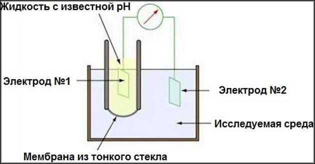
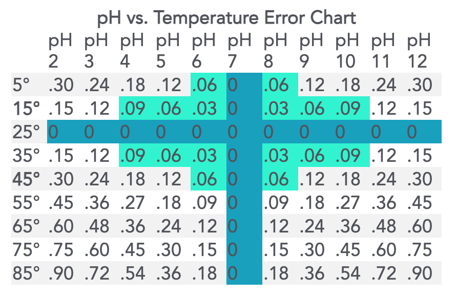
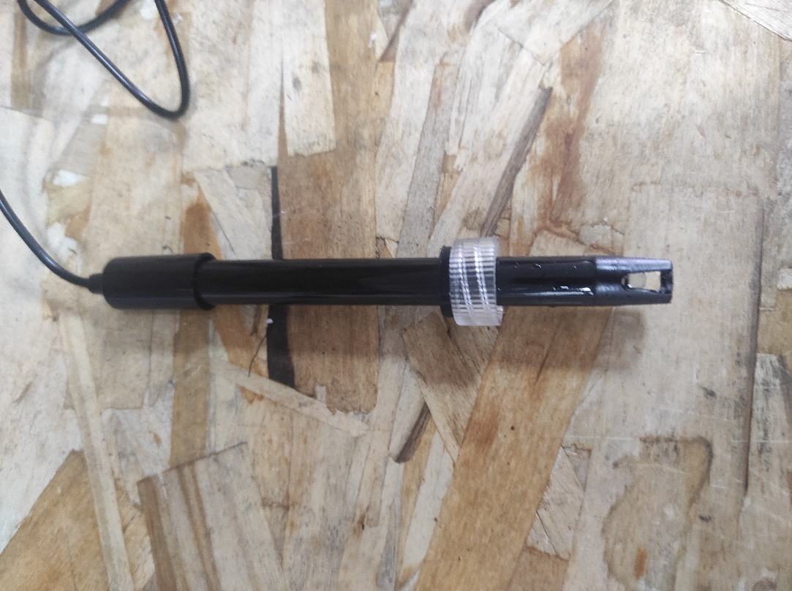
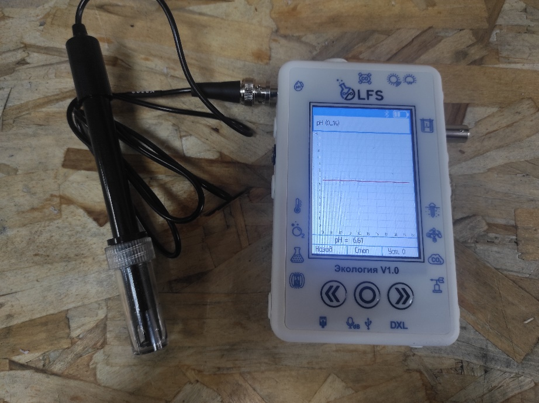

Датчик PH
---------

В различных химических средах может происходить процесс диссоциации химических соединений, будь то ``соль``, ``кислота`` или ``щелочь``. Данное явление заключается в распаде исходных молекул вещества на противоположно заряженные ионы, одним из которых может быть ``катион водорода H``. Отслеживая число этих ионов в объеме среды, можно определить такой её параметр, как кислотность. Живые организмы, устройство которых основана на химических взаимодействиях, очень зависимы от этих показателей, поэтому их ``необходимо учитывать`` при взращивании растительных культур. Для этого можно применить химические методы анализа, но удобнее воспользоваться электронным устройством вроде ``датчика pH``.

Устройство датчика
~~~~~~~~~~~~~~~~~~

Действие pH-метра основано на измерении величины ЭДС электродной системы, которая пропорциональна активности ионов водорода в растворе. То есть, измерительная схема, по сути, представляет собой вольтметр, проградуированный непосредственно в единицах pH, так как зависимость напряжения и кислотности прямая.

Входное сопротивление прибора должно быть не менее 1011 Ом, а входной ток не более 10 :sup:`11` А. 

В состав прибора обычно входит три электрода: ``измерительный``, ``индикаторный`` и ``вспомогательный``. 

- Измерительный реагирует на ионы водорода. Измерительные электроды сделаны из боросиликатного стекла, которое не боится окислителей. Но в то же время, борсиликат достаточно тонкий и электропроводный.

- Индикаторный электрод имеет вид трубки с шариком на конце. Трубка наполняется смесью хлорида серебра и соляной кислоты. В эту суспензию помещается серебряная проволока, выполняющая роль электрода. В трубке перемещаются положительно заряженные ионы водорода.

- Вспомогательный (или электрод сравнения) выглядит как ртутно-каломелевая паста, которая помещена в хлорид калия. Раствор хлорида калия выполняет роль проводника между исследуемой средой и пастой. Работает в паре с индикаторным электродом.

Современные рН-метры обычно совмещают в одном корпусе измерительные и вспомогательные электроды. Это позволяет производить измерения быстро, с минимальными погрешностями.

Калибровка датчика
~~~~~~~~~~~~~~~~~~

Строение датчика предполагает необходимость задания определенных значений в настройке для исправной работы. Для этого перед введением датчика в эксплуатацию требуется провести калибровку на минимум двух растворах с известными значениями кислотности. Так как наблюдается прямая зависимость между ``ЭДС`` в среде и показателем pH, то по двум известным значениям можно провести настройку

Важной деталью является влияние температуры среды. Её перепады могут вносить определённую погрешность в показания прибора.

**Примечание:** значения, выделенные голубым цветом, соответствуют погрешности менее 0,1 и могут не требовать температурной компенсации. Значения, выделенные темно-синим цветом — это температура и pH, при которых нет погрешности измерения pH в зависимости от температуры.

Большинство измерителей, контроллеров и других приборов облегчают этот процесс. 

Датчик от цифровой лаборатории LFS.
~~~~~~~~~~~~~~~~~~~~~~~~~~~~~~~~~~~

В комплекте лаборатории есть 2 датчика pH: для раствора и для почвы.

**Датчик pH раствора**

В рабочей части датчика расположен стеклянный шарик – измерительный электрод. Именно он погружается в раствор и снимает показания индуцируемого в нем потенциала

Результаты измерений после взятия датчика в изучаемый раствор. График приобретает вид прямой, так как значение pH в растворе не меняется. 

