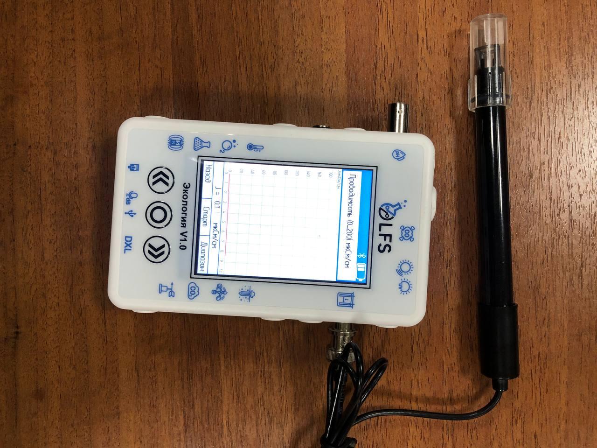

Датчик электропроводности жидкости
----------------------------------

Датчик электропроводности жидкости PolusLab — это современное устройство, предназначенное для точного измерения электропроводности жидкостей. Он использует передовые технологии и инновационные функции для получения точных показаний в режиме реального времени, что делает его важным инструментом для промышленности и исследовательских лабораторий.

Принцип работы
~~~~~~~~~~~~~~

Датчики, работающие по принципу измерения электропроводности жидкости, широко применяются в различных сферах, включая промышленность, медицину и науку. Они могут использоваться для измерения концентрации растворов, проводимости воды, определения уровня жидкости и контроля качества продукции в производстве.

Электроды датчика могут быть покрыты различными материалами, такими как золото, платина или серебро, в зависимости от требований к точности измерений и химической стойкости. Для измерения электропроводности жидкости с высоким содержанием частиц, таких как кровь или молоко, датчики обычно имеют более широкие электроды, чтобы уменьшить вероятность засорения.

Датчики могут быть как одно- так и многоканальными, что позволяет измерять электропроводность нескольких жидкостей одновременно. Некоторые датчики могут быть снабжены автоматическим контроллером, который регулирует подачу реагентов в жидкость, чтобы добиться желаемого значения электропроводности.

В современных датчиках электропроводности применяются различные технологии, такие как безконтактные измерения, где датчик не погружается в жидкость, а измеряет электропроводность через ее поверхностный слой, и микроэлектромеханические датчики, которые могут быть интегрированы в микрочипы. Все эти технологии направлены на повышение точности, чувствительности и удобства использования датчиков электропроводности жидкости.

Технические характеристики
~~~~~~~~~~~~~~~~~~~~~~~~~~

Датчик проводимости жидкости PolusLab может похвастаться несколькими техническими характеристиками, которые способствуют его точности и надежности. Некоторые из ключевых спецификаций включают в себя:

- ``Диапазон измерения:`` датчик предлагает широкий диапазон измерений, обычно от 0,1 мкСм/см до 2000 мСм/см.

- ``Точность:`` датчик обеспечивает высокую точность с отклонениями обычно менее 1% от значения полной шкалы.

- ``Температурная компенсация:`` Датчик включает температурную компенсацию, обеспечивая точные показания даже в различных температурных условиях.

- ``Время отклика:`` время отклика датчика обычно составляет менее одной секунды, что обеспечивает мониторинг в реальном времени и быструю обратную связь.

- ``Выход:`` датчик имеет аналоговый или цифровой выход, что обеспечивает бесшовную интеграцию с различными системами мониторинга.

