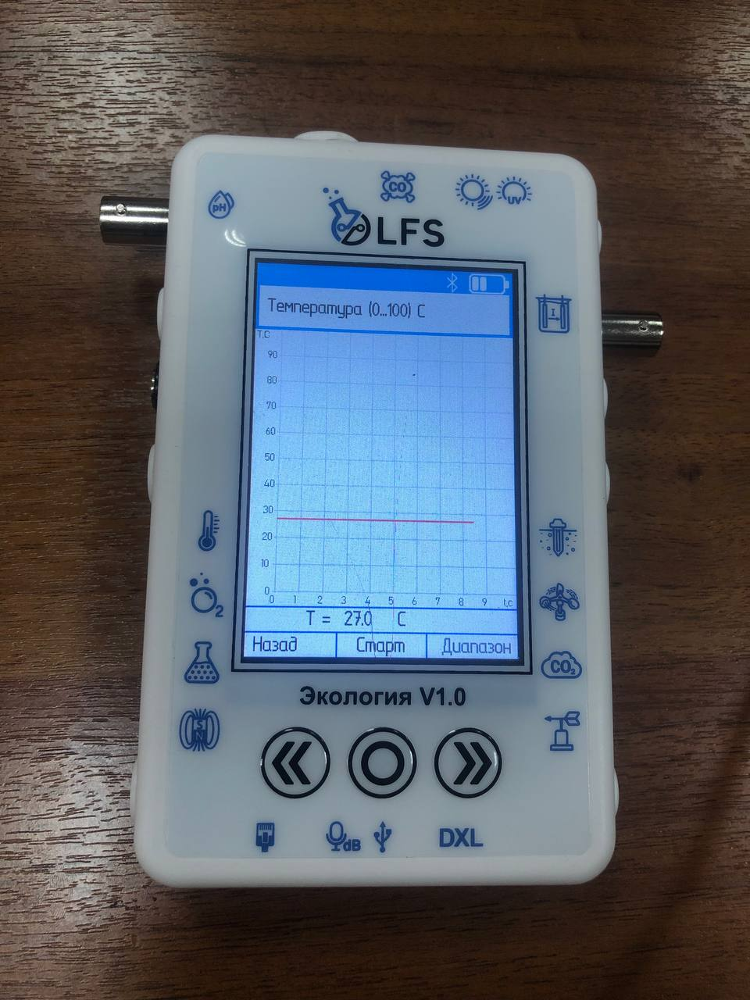

Температурный датчик
--------------------

Измерение температуры играет решающую роль в различных отраслях и приложениях, включая производство, здравоохранение и мониторинг окружающей среды. PolusLab, завоевавшая доверие множества организаций, является производителем цифровых лабораторий, поставщиком информационных и образовательных технологий для повышения качества образовательного процесса. Разработала усовершенствованный датчик температуры, который обеспечивает точные и надежные измерения температуры. В этом отчете представлен всесторонний анализ датчика температуры от PolusLab с выделением его функций, преимуществ и возможных областей применения.

Описание принципа работы термопары
~~~~~~~~~~~~~~~~~~~~~~~~~~~~~~~~~~

``Термопара`` - это преобразователь температуры, который используется для измерения температуры в различных промышленных и лабораторных приложениях. Она работает на принципе ``эффекта Томсона`` (термоэлектрического эффекта), согласно которому электрический ток может быть сгенерирован при наличии разности температур вдоль двух различных металлических проводников.

Термопара состоит из двух разных металлических проводников, соединенных в одном конце и расположенных в точке обнаружения температуры (измерительном месте). Когда разница температур между точкой измерения и соединением проводников возрастает, возникает разность потенциалов между двумя проводниками, которая определяется коэффициентом ``термоэдс``, зависящим от сорта металлов. Эта разность потенциалов измеряется с помощью милливольтметра и используется для определения температуры в соответствии с определенными эмпирическими уравнениями.

Принцип работы термопары основан на свойстве различных металлов, при котором они обладают различными ``температурными коэффициентами`` электрического сопротивления. Когда два разных металлических проводника соединены между собой, они образуют замкнутую цепь, в которой электроны из металла с более высоким температурным коэффициентом будут перемещаться в металл с более низким температурным коэффициентом. Это приводит к появлению разности потенциалов, которая зависит от разницы температур между точкой измерения и соединением проводников.

Характеристики датчика температуры PolusLab:
~~~~~~~~~~~~~~~~~~~~~~~~~~~~~~~~~~~~~~~~~~~~

1. Датчик температуры PolusLab оснащен несколькими дополнительными функциями, которые отличают его от обычных датчиков температуры. Некоторые ключевые особенности включают в себя:

2. Высокая точность: датчик температуры обеспечивает точные измерения температуры в узком диапазоне допусков, обеспечивая получение надежных данных для критически важных приложений.

3. Широкий диапазон температур: датчик работает в широком диапазоне температур, что позволяет ему работать в экстремальных условиях без ущерба для производительности.

4. Быстрое время отклика: датчик температуры обеспечивает быстрое время отклика, что позволяет контролировать и контролировать температуру в режиме реального времени.

5. Низкое энергопотребление: датчик температуры PolusLab спроектирован так, чтобы свести к минимуму энергопотребление, что делает его пригодным для устройств с батарейным питанием и энергоэффективных приложений.

