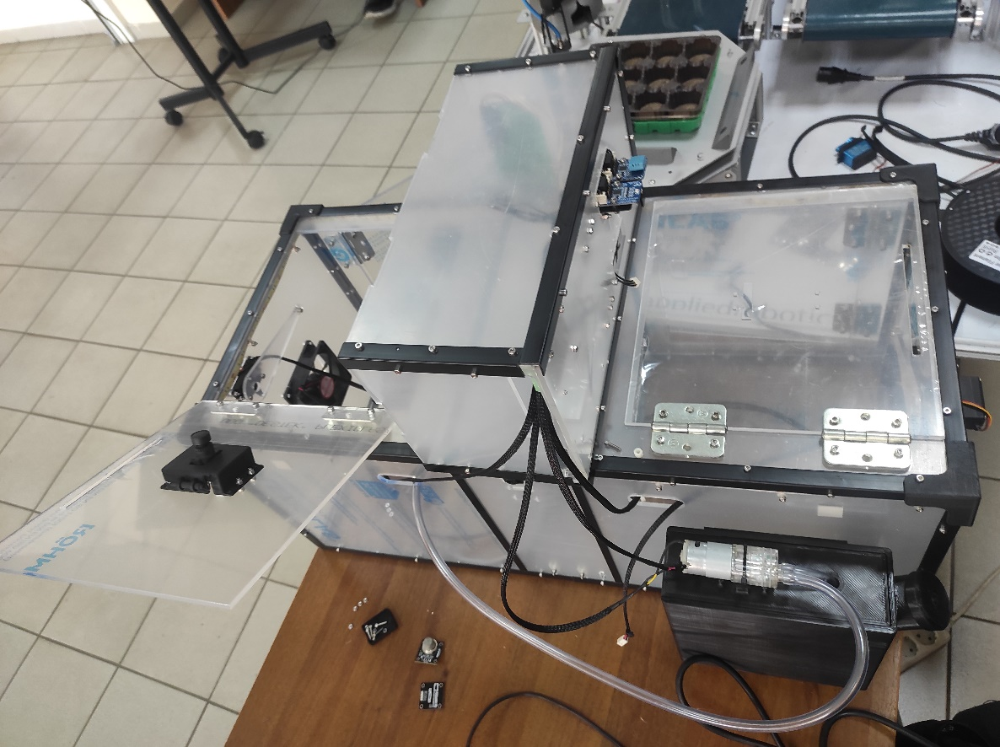
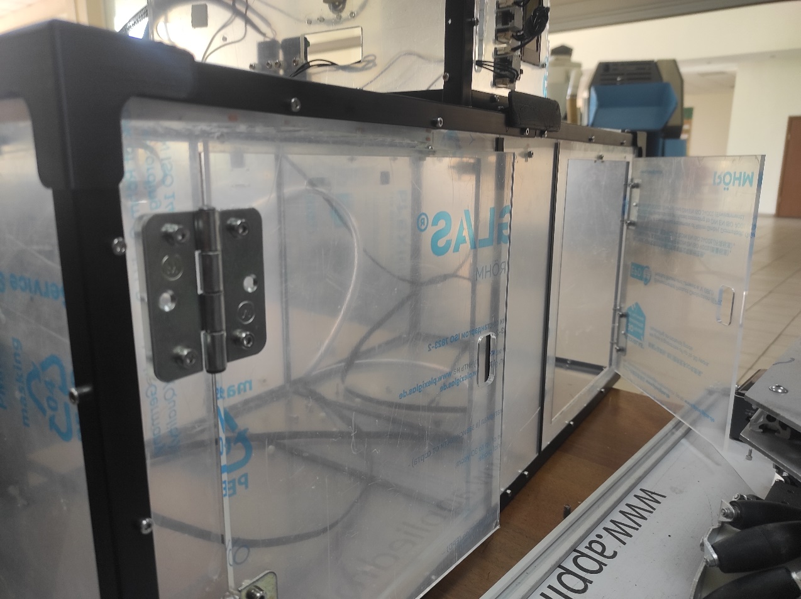
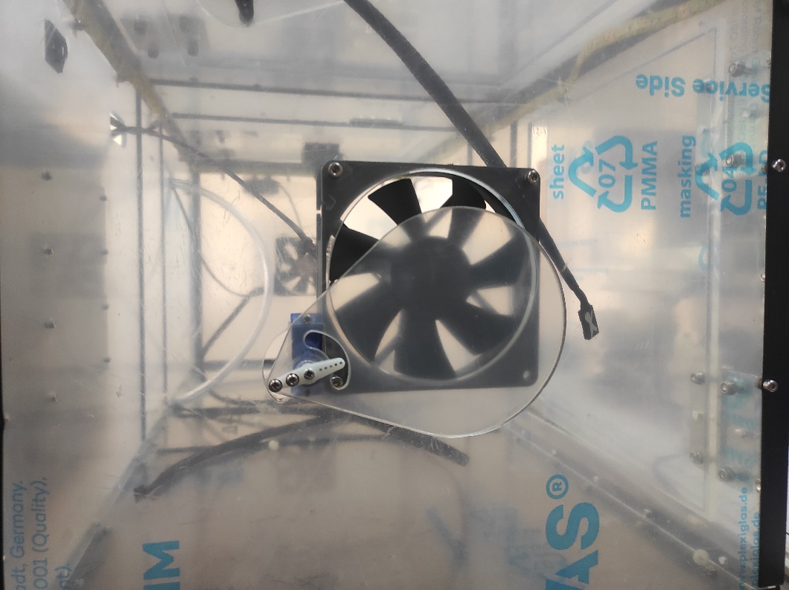
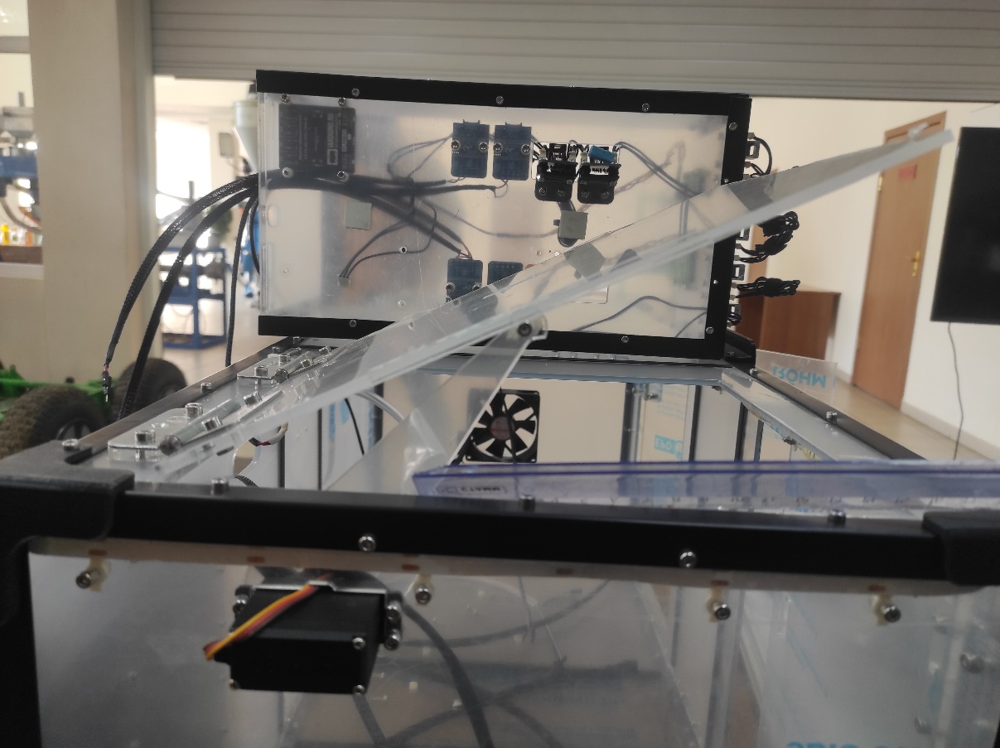

Конструкция корпуса автоматической теплицы
==========================================

Теплица представляет из себя прямоугольный короб 35*33*73см, выполненный из оргстекла (Рис.1). 
Ребра короба укреплены металлическими уголками, обеспечивая конструкции достаточную жёсткость.
На боковой длинной грани есть две прозрачные дверцы 22,5*27 см (Рис.4.), примыкающие к рёбрам, смежным с малыми гранями. Их назначение заключается в повышении удобства манипуляции внутренними объектами в случае вмешательства со стороны человека.

|pic1| |pic2|

Вентиляция
----------

Механическую часть представляют два вентилятора (Рис.2), по одному на каждой из малых гранях. Они обеспечивают принудительный продув, а за контроль потока отвечают два сервопривода, контролирующие крышки на вентиляторах. 

       Рис.2. Вентилятор и сервопривод

Еще ``два сервопривода`` поднимают два квадратных горизонтальных прозрачных люка 24.5*27 см (Рис.3), находящихся сверху на крышке и примыкающих к ребрам, смежным с крышкой и малыми гранями. Передача движения осуществляется через незакрепленный на люке рычаг, что позволяет без риска повреждения конструкции открыть люк вручную в любой момент. Данный элемент конструкции даёт возможность осуществлять контролируемый естественный воздухообмен с внешней атмосферой.
Использование разных способов обновления воздуха внутри обеспечивает теплице универсальность и позволяет обеспечить эффективность конструкции при выращивании различных культур.

       Рис.3. Один из верхних люков с рычажной системой подъема сервоприводом

Полив
-----

В представленной концепции используется четыре датчика внутри самой теплицы: ``света``, ``газа``, ``влажности воздуха`` и ``влажности почвы``. Пятый датчик – ``поплавок``, который находится в резервуаре с водой для полива отслеживает её уровень. Резервуар представляет из себя пластмассовую чёрную канистру на ``750мл``, прикрепленную снаружи теплицы.

Светодиодная лента
------------------

Светодиодная лента выполняет сигнализационную функцию для сообщения ответственному лицу о случившейся неполадке. 

Блок управления
---------------

Контроль за системой обеспечивает блок управления.  Он оснащён дисплеем и клавишами, что позволяет вносить корректировки в работу теплицы в любой удобный момент. Блок связан с коробом посредствам гибких проводов, от чего его расположение можно легко менять по мере необходимости. Увидеть блок можно лежащим сверху теплицы на Рис.1.

Контроль за системой обеспечивает ``Блок управления``.  Он оснащён ``дисплеем`` и ``клавишами``, что позволяет вносить корректировки в работу теплицы в любой удобный момент. Блок связан с коробом посредствам гибких проводов, от чего его расположение можно легко менять по мере необходимости. Увидеть блок можно лежащим сверху теплицы на Рис.1.
