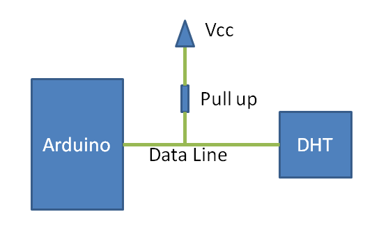
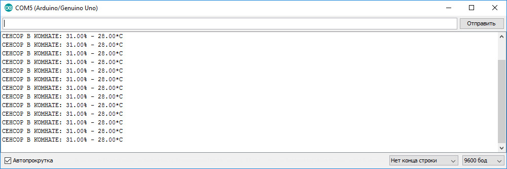
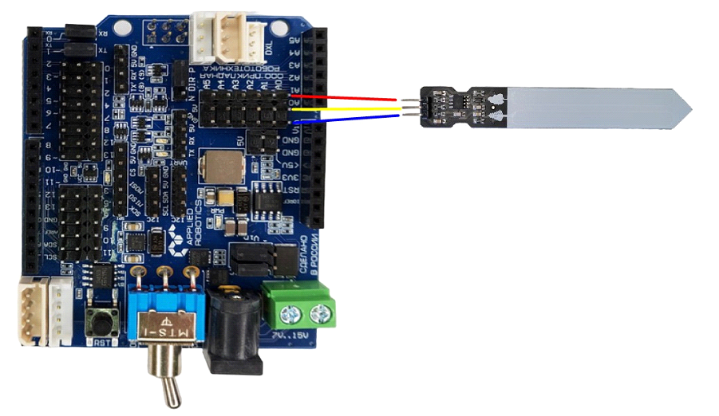
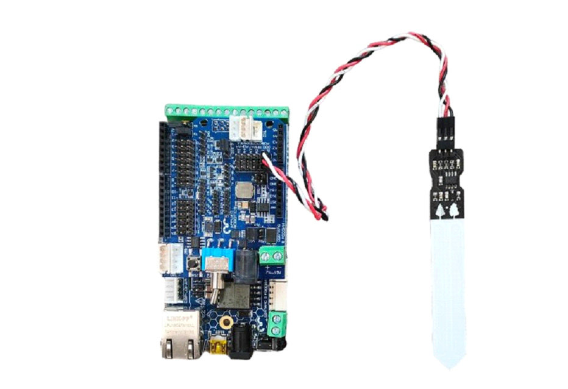
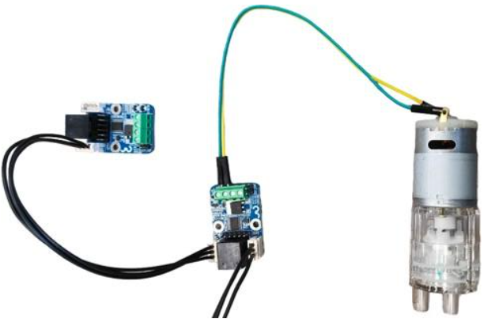
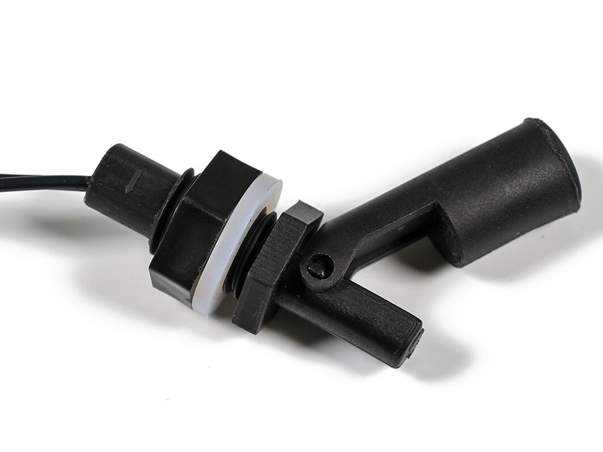
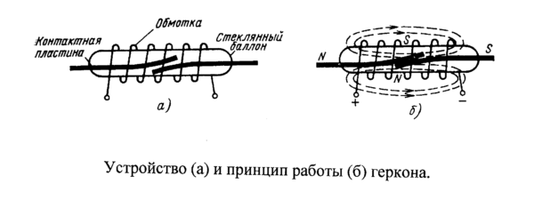
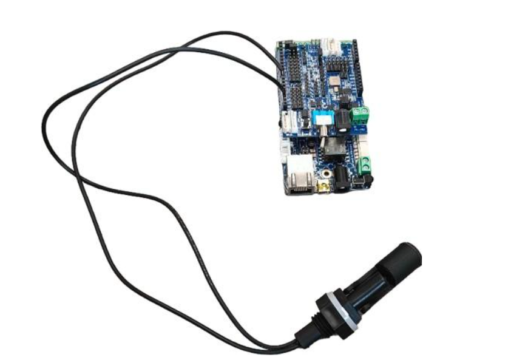
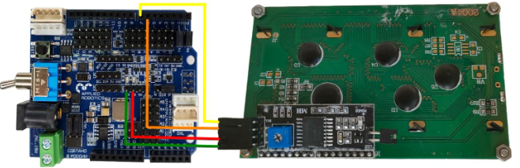
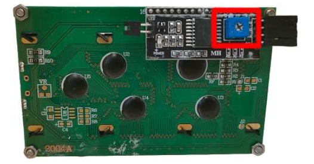

Программирование платы
======================

Программирование модуля датчик температуры и влажности
------------------------------------------------------

Характеристика датчика 
~~~~~~~~~~~~~~~~~~~~~~

- Напряжение питания и I/O: от 3,3 до 5,5 В;

- Тип датчика влажности: резистивный;

- Диапазон измерения влажности: от 20% до 90%;

- Погрешность при измерении влажности: 5%;

- Тип датчика температуры: NTC термистор;

- Диапазон измерения температуры: от 0°C до 50°C;

- Погрешность при измерении температуры: 2%;

- Частота опроса: не более 1 Гц (1 раз в сек.);

- Время отклика при измерении влажности: 10 с.

Процесс передачи данных от датчика DHT11 к Arduino
~~~~~~~~~~~~~~~~~~~~~~~~~~~~~~~~~~~~~~~~~~~~~~~~~~

Вначале плата Arduino подает на датчик DHT11 сигнал перепада с высокого уровня на низкий с задержкой 18 мкс чтобы запустить датчик DHT11 в работу. Затем Arduino pull-up (подтягивает ее к Vcc как показано на рисунке) линию передачи данных ждет 20-40 мкс ответа от датчика DHT11. Как только датчик DHT11 обнаруживает сигнал, запускающий его в работу (сигнал старта), он передает ответ в виде сигнала низкого уровня длительностью около 80 мкс. А затем контроллер DHT датчика pull up линию передачи данных и удерживает ее в этом состоянии около 80 мкс пока DHT модуль готовится к передаче данных.

Как только на линии передачи данных появилось напряжение низкого уровня это значит что датчик DHT11 передает ответный сигнал на Arduino. Как только этот процесс будет завершен, DHT снова "подтягивает" (pull-up) линию передачи данных на 80 мкс чтобы подготовиться к передаче данных.

Формат данных, передаваемых с DHT на Arduino, для каждого бита начинается с 50 мкс напряжения низкого уровня, а продолжительность напряжения высокого уровня после этого зависит от того какой бит передается - “0” или “1”.

Подключение модуля
~~~~~~~~~~~~~~~~~~  

Подключение модуля к ``Arduino Mega2560`` выполняется в соответствии с распиновкой разъёма. Таким образом, ``линию модуля 5В`` подключим к линии 5В Mega2560, лини. GND - к GND Mega2560, а ``линию управления SIG`` - к цифровой линии 5. В результате, внешний вид подключённого модуля будет выглядеть, как на рисунке:

.. figure:: images/1.png
       :width: 60%
       :align: center
       :alt: датчик температуры и влажности почвы

Программирование
~~~~~~~~~~~~~~~~

Поскольку данный модуль имеет униикальный протокол обмена данными, подобный 1-Wire, для работы с ним рекомендуется использовать подходящую библиотеку. Таких библиотек существует достаточно много, но в данном примере воспользуемся библиотекой “iarduino_DHT”:

    .. highlight:: Arduino

    #include <iarduino_DHT.h> // Подключаем библиотеку для работы с датчиком DHT
    iarduino_DHT sensor(5);   // Объявляем объект, указывая номер вывода, к которому подключён модуль
    void setup(){
    Serial.begin(9600);     // Инициируем передачу данных в монитор последовательного порта, на скорости 9600 бод
        delay(1000);            // Приостанавливаем выполнение скетча на 1 секунду, для перехода датчика в активное состояние
    }
    void loop(){                 Serial.print  ("CEHCOP B KOMHATE: ");
    switch(sensor.read()){  // Читаем показания датчика
        case DHT_OK:             Serial.println((String) sensor.hum + "% - " + sensor.tem + "*C"); break;
        case DHT_ERROR_CHECKSUM: Serial.println("HE PABEHCTBO KC");                                break;
        case DHT_ERROR_DATA:     Serial.println("OTBET HE COOTBETCTB. CEHCOPAM 'DHT'");            break;
        case DHT_ERROR_NO_REPLY: Serial.println("HET OTBETA");                                     break;
        default:                 Serial.println("ERROR");                                          break;
    } delay(8000);          // Приостанавливаем выполнение скетча на 8 секунд, между выводами показаний
    }

В результате, загрузив данный код в контроллер стандартным способом и открыв монитор порта, можно увидеть следующие данные:

Программирование модуля датчик влажности почвы
----------------------------------------------

Характеристики 
~~~~~~~~~~~~~~

- Рабочее напряжение: 3,3 — 5 Вольт

- Ток потребления: 35 мА

- Выход: цифровой и аналоговый

- Размер модуля: 16×30 мм

- Размер щупа: 20×60 мм

Принцип работы
~~~~~~~~~~~~~~

Принцип работы датчика влажности почвы достаточно прост – он содержит ``2 зонда с оголенными контактами``, которые работают как резистор с переменным сопротивлением – их сопротивление изменяется в зависимости от уровня влаги в почве. Сопротивление данных зондов обратно пропорционально влажности почвы, то есть чем выше содержание влаги почвы, тем лучше ее проводимость и тем меньше ее сопротивление. Низкий уровень влаги в почве свидетельствует о ее плохой проводимости и, следовательно, ее большом сопротивлении. Датчик обеспечивает на своем выходе уровень аналогового напряжения, пропорциональный сопротивлению почвы.

Подключение
~~~~~~~~~~~

Используя провода ``«Папа — Мама»``, подключаем  напрямую к контроллеру ``ESP-JSAR``.

Датчик влажности почвы является аналоговым датчиком и подключается через блок аналоговых устройств на плате расширения. На экран можно выводить показания считываемые датчиком. На рисунке 30 показано подключение в живую.

|pic1| |pic2|

Программирование
~~~~~~~~~~~~~~~~

::

  #include <JsAr.h>               // Подключение библиотеки для работы с платой ESP.

  void setup() {
    JsAr.begin();                 // Начинаем работу с платой ESP. Без этой строчки ничего работать не будет!
    pinMode(A0, INPUT);           // Устанавливаем пин A0 как вход.
    Serial.begin(115200);         // Начинаем общение по сериал-порту.
  }

  void loop() {
    int tempData = analogRead(A0);                  // Считываем аналоговый сигнал.
    int intData = map(tempData, 0, 2048, 0, 100);   // Преобразовываем сигнал из некоторых условных единиц в проценты.
    String stringData = String(intData);            // Преобразовываем данные в строку.
    Serial.println(stringData);                     // Выводим в сериал-порт.
    delay(100);
  }

Программирование помпы
----------------------

Общие сведения
~~~~~~~~~~~~~~

Многофункциональный универсальный насос R385 относится к разновидности диафрагменных (мембранных) объёмных насосов. Его механизм представляет совокупность пропускных мембран в сочетании с пластиковым поршневым механизмом, установленным на ось двигателя. Ось смещена от центра под небольшим углом, заставляя поршни при вращении мотора поочерёдно втягиваться и возвращаться в исходное положение. Таким образом, в насосе одновременно создаются всасывающая и выталкивающая силы.

Сферы применения:
~~~~~~~~~~~~~~~~~

Аквариумистика, минифонтаны, декоративные дизайнерские решения в оформлении интерьера и ландшафта, гидропоника, садоводство и цветоводство. А также бытовое, промышленное и медицинское оборудование.

Характеристики
~~~~~~~~~~~~~~

- Рабочее напряжение: 6 ... 12 В.

- Потребляемый ток: 200 ... 600 мА.

- Диаметр патрубков (внешний): 7 мм.

- Диаметр патрубков (внутренний): 3 мм.

- Расход при 12 В: 1.5-2 литра/минуту

- Температура жидкости: до 80°С

Подключение
~~~~~~~~~~~

Насос подключается точно так же как и вентиляторы для системы вентиляции, отличия только в программном коде. Так же насос может взаимодействовать с датчиком влажности почвы и с датчиком уровня воды. К примеру когда влажность почвы недостаточна, включается насос и насыщает почву водой. Или насос будет наполнять емкость водой, пока датчик уровня воды не тонет.

Программирование
~~~~~~~~~~~~~~~~

::

  #include <JsAr.h>	// Подключение библиотеки для работы с платой ESP. #include <DxlMaster.h>		// Подключение библиотеки для работы с DXL-устройствами.
  DynamixelDevice pump(0x0D);

  void setup() {
    JsAr.begin();	// Начинаем работу с платой ESP. Без этой строчки ничего работать не будет!
    DxlMaster.begin(57600);	// Начинаем работу с DXL-устройствами.
    pump.init();	// Инициализируем кнопку и силовой ключ. 
  } 

  void loop() {
    pump.write(28, 255);	// Непосредственное открытие ключа записью значения 255 в нужный регистр.
  }

Программирование датчика уровня воды
------------------------------------

       
Характеристики
~~~~~~~~~~~~~~

- Максимальная нагрузка: 10 Вт

- Максимальное напряжение переключения: DC 100 В

- Максимальный ток переключения: 0.5 А

- Подключение: двухпроводное, длина кабеля - 40 см

       
Принцип работы поплавка
~~~~~~~~~~~~~~~~~~~~~~~

Поплавковый датчик уровня воды с ``магнитом и герконом`` основан на изменении магнитного поля, вызванного перемещением поплавка по мере изменения уровня жидкости. 

Магнит прикрепляется к поплавку, а геркон (герметичный контакт, чувствительный к магнитному полю) устанавливается в фиксированной точке внутри датчика. Когда уровень воды поднимается, поплавок поднимается вместе с ним, приближая магнит к геркону. Магнитное поле от магнита ``активирует геркон``, вызывая замыкание контактов.

Когда уровень воды снижается, поплавок опускается, удаляя магнит от геркона. Это приводит к размыканию контактов геркона. Таким образом, изменение состояния контактов геркона можно использовать для определения уровня воды.

Подключение
~~~~~~~~~~~

Схема подключения поплавка изображена на фото.

Программирование
~~~~~~~~~~~~~~~~

::

  #include <JsAr.h>	// Подключение библиотеки для работы с платой ESP.
  #define floatSensor 4	// Объявление пина, к которому подключен поплавок.

  void setup() {
    JsAr.begin();	// Начало работы с платой ESP.
    pinMode(floatSensor, INPUT_PULLUP);	// Настраиваем пин поплавка как вход.
    Serial.begin(115200);	// Начало общения по сериал порту.
  }

  void loop() {
    if (!digitalRead(floatSensor)) {	// Считываем данные с пина. Если на пине логический 0, то цепь разомкнута,
      Serial.println("CEHCOP TOHET");	// а значит, сенсор тонет.
    }
  }

Программирование светодиодной ленты
-----------------------------------

Общие сведения
~~~~~~~~~~~~~~

Светодиодная лента имеет 2 контакта, которые позволяют подключать их к источнику питания и управляющей электронике. Лента может быть различной длины и ширины, и ее можно легко нарезать на нужные отрезки, обычно каждые несколько светодиодов или по определенным меткам. 

Одним из основных преимуществ светодиодных лент является их гибкость, которая позволяет устанавливать их на различные поверхности и в разных формах. Они также ``энергоэффективны``, потребляя меньше энергии, чем традиционные источники света, и имеют длительный срок службы. Кроме того, светодиодные ленты обладают хорошей контролируемостью яркости, что позволяет создавать разнообразные эффекты освещения. 

Подключение светодиодной ленты
~~~~~~~~~~~~~~~~~~~~~~~~~~~~~~

Подключение происходит также как и с остальными модулями,  подключаемыми в ``силовой ключ DXL``: красный провод к 5V, черный к GND.

Программирование
~~~~~~~~~~~~~~~~

::

  #include <JsAr.h>	// Подключение библиотеки для работы с платой ESP. #include <DxlMaster.h>		// Подключение библиотеки для работы с DXL-устройствами.
  DynamixelDevice ledstrip(0x0C);

  void setup() {
    JsAr.begin();	// Начинаем работу с платой ESP. Без этой строчки ничего работать не будет!
    DxlMaster.begin(57600);	// Начинаем работу с DXL-устройствами.
    ledstrip.init();	// Инициализируем кнопку и силовой ключ. 
  } 

  void loop() {
    ledstrip.write(28, 255);	// Непосредственное открытие ключа записью значения 255 в нужный регистр.
  }

Программирование RGB ленты
--------------------------

Общие сведения
~~~~~~~~~~~~~~

Каждый светодиод на RGB-ленте может изменять свою яркость и цвет, комбинируя эти три основных цвета. Путем изменения интенсивности каждого цвета можно создавать различные оттенки и оттенки света. Например, если все три цвета светодиода светят с максимальной яркостью, то будет получен белый свет. 

Подключение
~~~~~~~~~~~

Подключение RGB-ленты к модулю силовых ключей происходит не так как обычная светодиодная лента. У RGB-ленты три цветовых канала “Красный”, “Зеленый”, “Синий”, следовательно подключение должно быть по трем разным каналам.

.. |pic3| image:: images/7.png
   :width: 20%

.. |pic4| image:: images/8.png
   :width: 60%

|pic3| |pic4|

Программирование
~~~~~~~~~~~~~~~~

::

  #include <JsAr.h>	// Подключение библиотеки для работы с платой ESP. 
  #include <iarduino_I2C_Relay.h>	// Подключение библиотеки для работы с I2C силовым ключом.

  iarduino_I2C_Relay fets1(0x09);	// Создаем объект для работы с силовым ключом.
  void setup() {
    JsAr.begin();	// Начинаем работу с платой ESP.
    fets1.begin();	// Инициализируем силовой ключ.
    Serial.begin(115200);
  }

  void loop() {
    if (Serial.available()) {	// В случае, если в буфере что-то есть, то заходим в условие.
      char a = Serial.read();	// Считываем один символ из буфера.
      switch(a) { // Здесь массив вариантов включения и выключения необходимых цветов в зависимости от символа.
        case '1': fets1.digitalWrite(1, HIGH); 
          break;
        case 'q': fets1.digitalWrite(1, LOW); 
          break; 
        case '2': fets1.digitalWrite(2, HIGH); 
          break; 
        case 'w': fets1.digitalWrite(2, LOW); 
          break; 
        case '3': fets1.digitalWrite(3, HIGH); 
          break; 
        case 'e': fets1.digitalWrite(3, LOW); 
          break; 
        default:
          fets1.digitalWrite(1, LOW); // Если пришел символ, который мы не ожидаем, выключаем все.
          fets1.digitalWrite(2, LOW); 
          fets1.digitalWrite(3, LOW); 
          break;
      } 
    }
  }

Программирование дисплея Agrolab GH
--------------------------------

Принцип работы
~~~~~~~~~~~~~~

.. highlight:: жидкокристаллический экран, жидкие кристаллы, поляризационный светофильтр, светопропускание, LCD-матрица, LCD-экраны, компьютеры, мониторы, дисплеи, электронно-лучевые трубки, быстродействие, инерционность, разрешение, цветовая глубина

Принцип работы любого жидкокристаллического экрана основан на свойстве жидких кристаллов изменять (поворачивать) плоскость поляризации проходящего через них света пропорционально приложенному к ним напряжению. Если на пути поляризованного света, прошедшего через жидкие кристаллы, поставить поляризационный светофильтр (поляризатор), то, изменяя величину приложенного к жидким кристаллам напряжения, можно управлять количеством света, пропускаемого поляризационным светофильтром. Если угол между плоскостями поляризации прошедшего сквозь жидкие кристаллы света и светофильтра составляет 0 градусов, то свет будет проходить сквозь поляризатор без потерь (максимальная прозрачность), если 90 градусов, то светофильтр будет пропускать минимальное количество света (минимальная прозрачность).

Таким образом, используя жидкие кристаллы, можно изготавливать оптические элементы с изменяемой степенью прозрачности. При этом уровень светопропускания такого элемента зависит от приложенного к нему напряжения. Любой ЖК-экран у монитора компьютера, ноутбука, планшета или телевизора содержит от нескольких сотен тысяч до нескольких миллионов таких ячеек, размером долей миллиметра. Они объединены в LCD-матрицу и с их помощью мы можем формировать изображение на поверхности жидкокристаллического экрана.

Жидкие кристаллы были открыты еще в конце XIX века. Однако первые устройства отображения на их основе появились только в конце 60-х годов XX века. Первые попытки применить LCD-экраны в компьютерах были предприняты в восьмидесятых годах прошлого века. Первые жидкокристаллические мониторы были монохромными и сильно уступали по качеству изображения дисплеям на электронно-лучевых (ЭЛТ) трубках. Главными недостатками LCD-мониторов первых поколений были:

- Низкое быстродействие и инерционность изображения;

- «хвосты» и «тени» на изображении от элементов картинки;

- Плохое разрешение изображения;

- Черно-белое или цветное изображение с низкой цветовой глубиной;

Подключение дисплея
~~~~~~~~~~~~~~~~~~~

Сам дисплей подключается через интерфейс I2C к плате расширения в блоки.

После подачи питания на дисплей и включения дисплея, необходимо настроить контрастность при помощи отвертки поворачивая потенциометр(Рисунок 17) до четкого изображения на дисплее.

После настройки контрастности дисплея, мы увидим выходные данные. Дисплей готов к дальнейшей работе. При помощи программного кода можно выводить на дисплей любые параметры которые необходимы.

Программирование
~~~~~~~~~~~~~~~~

Простой пример проверки работоспособности диплея::

  #include <JsAr.h>	// Подключение библиотеки для работы с платой ESP. 
  #include <Wire.h>		// Подключение библиотеки для работы с I2C устройствами.
  #include <LiquidCrystal_I2C.h>	// Подключение библиотеки для работы с LCD-дисплеем.

  /* Создаем экземпляр класса LiquidCrystal_I2C,
  называем его lcd. Первый аргумент - адрес I2C-устройства,
  второй - количество символов в строке, третий -
  количество строк, поддерживаемое данным дисплеем.
  */
  LiquidCrystal_I2C lcd(0x27, 16, 4);

  unsigned long timerLCD = 0;	// Создаем таймер для обновления данных дисплея.

  void setup() {
    JsAr.begin();	// Начинаем работу с платой ESP. Без этой строчки ничего работать не будет!
    lcd.init();	// Инициализируем дисплей. 
    lcd.backlight();		// Включаем подсветку
    timerLCD = millis();	// Приравниваем таймер к текущему времени.
  }

  void loop() {
  /* Если разница между текущим временем и значением таймера
  отличается больше, чем на 1000 миллисекунд (1 секунда),
  то заходим внутрь условия (т.е. условие будет выполняться
  раз в секунду, не препятствуя выполнению остального кода.
  */
    if (millis() - timerLCD > 1000) {
      timerLCD = millis();	                // Присваиваем таймеру текущее время (последнего срабатывания).
      lcd.clear();	                        // Очищаем дисплей от данных.
      lcd.setCursor(0, 0);	                // Ставим курсор на позицию (символ, строка). 
      lcd.print("Applied Robotics");	    	// Выводим надпись Applied Robotics. 
      lcd.setCursor(0, 1);	                // Переносим курсор на новую строку. 
      lcd.print(timerLCD / 1000);		        // Выводим время в секундах.
    }
  }

Написание интерфейса на дисплее и управление с кнопок
-----------------------------------------------------

Подключение
~~~~~~~~~~~

Подключение дисплея продемонстрировано в предыдущем пункте. 

Кнопки соединяются последовательно по протоколу DXL. У каждой имеется свой айди, который можно определить через библиотеку ``DynamixelDevice`` со встроенным примером ``Console``.

Программирование интерфейса
~~~~~~~~~~~~~~~~~~~~~~~~~~~

  :: 
    
    #include <JsAr.h>   // Подключение библиотеки для работы с платой ESP.
    #include <DxlMaster2.h>       // Подключение библиотеки для работы с DXL-устройствами.
    #include <Wire.h>                     // Подключение библиотеки для работы с I2C устройствами.
    #include <LiquidCrystal_I2C.h>        // Подключение библиотеки для работы с LCD-дисплеем.

    #define NUM_BTNS 5

    uint8_t ids[NUM_BTNS] = {0x01,0x02,0x03,0x04,0x05};
    DynamixelDevice* btnDxl = (DynamixelDevice*)malloc(sizeof(DynamixelDevice) * NUM_BTNS);

    LiquidCrystal_I2C lcd(0x27, 16, 4);

    int init_buttons()
    {
      for(int i=0;i<NUM_BTNS;i++)
      {
        btnDxl[i] = DynamixelDevice(ids[i]);
        btnDxl[i].init();
        if (btnDxl[i].ping() != DYN_STATUS_OK)
          return ids[i];
      }
      return -1;
      
    }

    int read_buttons()
    {
      uint8_t btn;                                       // Переменные, необходимые для работы с кнопкой.

      for(int i=0;i<NUM_BTNS;i++)
      {
        btnDxl[i].read((uint8_t)27, (uint8_t)1, &btn); // Считывание регистра "нажатия" с кнопки.
        if (btn == 1)
        {
          delay(10);
          btnDxl[i].read((uint8_t)27, (uint8_t)1, &btn); // Считывание регистра "нажатия" с кнопки.
          if (btn ==1)
            return i;
        }
      }
      return -1;
    }

    int init_lcd()
    {
      byte count = 0;
      
      Wire.begin();
      for (byte i = 1; i < 120; i++)
      {
        Wire.beginTransmission (i);
        if (Wire.endTransmission () == 0)
          {
            if(i == 0x27)
            {
              count++;
              Serial.println("DISPLAY FOUND!");
              break;
            }
          delay (1);  
          } 
      } 

      if (count == 0)
        return 1;
        
      lcd.init();                                           // Инициализируем дисплей.
      lcd.backlight();                                      // Включаем подсветку
      lcd.setCursor(4.5, 1);                                // Устанавливаем курсор в середину 2 строки
      lcd.print("AGROLAB");                                 // Выводим текст
      delay(500);
      lcd.clear();  
      return -1;
    }

    typedef void(*Action)(); 

    class menu{
      private:
        String * menu_items;
        int selected_item;
        uint8_t num_items;
        Action   *actions;
        bool active; 
      public:
        menu(uint8_t n, String * items)
        {
          num_items = n - 1;
          menu_items = new String[n];
          actions = new Action[n];
          selected_item = 0;
          for(int i = 0; i<n;i++)
          {
            menu_items[i] = items[i];
            actions[i] = NULL;
          }
          active = false;
        }
        
        void bind_action(uint8_t n, Action act)
        {
          actions[n] = act;
        }
        
        void menu_down()
        {
          selected_item++;
          if (selected_item> num_items)
            selected_item = 0;
        }
        
        void menu_up()
        {
          selected_item--;
          if (selected_item < 0 )
            selected_item = num_items;
        }
        
        void menu_push()
        {
          if(actions[selected_item] == NULL)
            Serial.println("ACTION IS NOT BINDED TO THIS MENU ITEM");
          else
            actions[selected_item]();  
        }
        
        void draw_menu()
        { 
          if (active)
          { 
            lcd.clear();
            lcd.setCursor(0, selected_item % 4);
            lcd.print(char(126));                          
            int page_end = (selected_item / 4)*4 + 4 > num_items ? num_items % 4+1: 4;
            for(int i = 0; i<page_end; i++)  
            {                       
            lcd.setCursor(1, i);
            lcd.print(menu_items[(selected_item / 4)*4+i]);
            }
          }        
        }

        void set_active()
        {
          active = true;
        }
        
        void unset_active()
        {
          active = false;
        }
        
        bool get_active()
        {
          return active;
        }
    };

    #define MENU_MAIN_ITEMS 3
    String main_items[MENU_MAIN_ITEMS] = { "Controls", "Settings", "Calibration" };
    menu menu_main(MENU_MAIN_ITEMS, main_items);

    #define MENU_SUB_CONTROLS 5
    String controls_items[MENU_SUB_CONTROLS] = { "Web Set", "Airing Set", "LED Set", "Watering", "Back" };
    menu menu_controls(MENU_SUB_CONTROLS, controls_items);

    #define MENU_SUB_AIRING 4
    String airing_items[MENU_SUB_AIRING] = { "Time", "Humidity", "Button", "Back" };
    menu menu_airing(MENU_SUB_AIRING, airing_items);

    void enter_controls() {
      menu_main.unset_active();
      menu_controls.set_active();
    }
    void enter_settings() {
      Serial.println("Settings unavailable");
    }
    void enter_calibration() {
      Serial.println("Calibration unavailable");
    }
    void enter_airing() {
      menu_controls.unset_active();
      menu_airing.set_active();
    }

    void enter_web() {
      Serial.println("Web settings unavailable");
    }
    void enter_led() {
      Serial.println("LED settings unavailable");
    }
    void enter_watering() {
      Serial.println("Watering settings unavailable");
    }
    void back_main() {
      menu_main.set_active();
      menu_controls.unset_active();
    }

    void airing_time() {
      Serial.println("Airing is set to on time");
    }
    void airing_hum() {
      Serial.println("Airing is set to on humidity");
    }
    void airing_but() {
      Serial.println("Airing is set to on button");
    }
    void airing_back() {
      menu_controls.set_active();
      menu_airing.unset_active();
    }

    void setup() {
      JsAr.begin();            // Начинаем работу с платой ESP. Без этой строчки ничего работать не будет!
      DxlMaster.begin(57600);  // Начинаем работу с DXL-устройствами.
      Serial.begin(115200);

      Serial.println(String("ONBOARD VOLTAGE:") + JsAr.readVoltage());

      int status = init_buttons();
      if (status != -1) {
        Serial.println("BTN WITH ID " + String(ids[status]) + " NOT INITIALISED! Aborting.");
        ESP.restart();
      }

      status = init_lcd();
      if (status != -1) {
        Serial.println("LCD NOT INITIALISED! Aborting.");
        ESP.restart();
      }

      menu_main.bind_action(0, enter_controls);
      menu_main.bind_action(1, enter_settings);
      menu_main.bind_action(2, enter_calibration);
      menu_main.set_active();

      menu_controls.bind_action(0, enter_web);
      menu_controls.bind_action(1, enter_airing);
      menu_controls.bind_action(2, enter_led);
      menu_controls.bind_action(3, enter_watering);
      menu_controls.bind_action(4, back_main);

      menu_airing.bind_action(0, airing_time);
      menu_airing.bind_action(1, airing_hum);
      menu_airing.bind_action(2, airing_but);
      menu_airing.bind_action(3, airing_back);
    }

    void loop() {
      delay(100);
        Serial.println(menu_main.get_active());
          Serial.println(menu_controls.get_active());
            Serial.println(menu_airing.get_active());
            Serial.println("---------------------------");
      menu_main.draw_menu();
      menu_controls.draw_menu();
      menu_airing.draw_menu();
      
      switch (read_buttons()) {
        case 0:
          if(menu_main.get_active())
          {
            menu_main.menu_down();
          }else
          if(menu_controls.get_active())
          {
            menu_controls.menu_down();
          }else
          if(menu_airing.get_active())
          {
            menu_airing.menu_down();
          }
          break;
        case 1:
          if(menu_main.get_active())
          {
            menu_main.menu_up();
          }else
          if(menu_controls.get_active())
          {
            menu_controls.menu_up();
          }else
          if(menu_airing.get_active())
          {
            menu_airing.menu_up();
          }
          break;
        case 2:
          if(menu_main.get_active())
          {
            menu_main.menu_push();
          }
          else
          if(menu_controls.get_active())
          {
            menu_controls.menu_push();
          }else
          if(menu_airing.get_active())
          {
            menu_airing.menu_push();
          }
          break;
      }
    } 
