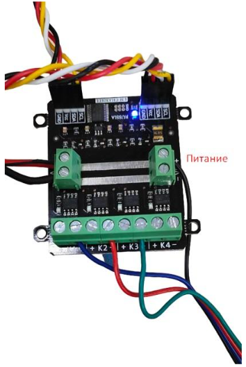
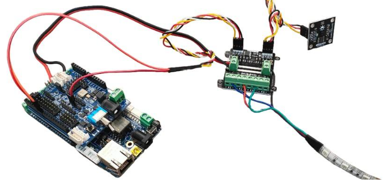

Программирование RGB ленты
==========================

Подключение
-----------

Подключение RGB-ленты к модулю силовых ключей происходит не так как обычная светодиодная лента. У RGB-ленты три цветовых канала “Красный”, “Зеленый”, “Синий”, следовательно подключение должно быть по трем разным каналам.

|pic1| |pic2|

Программирование RGB-ленты
--------------------------

