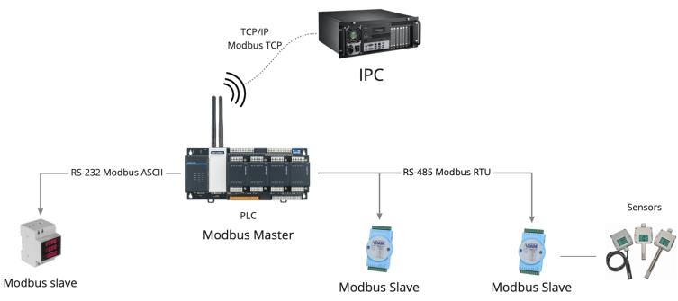
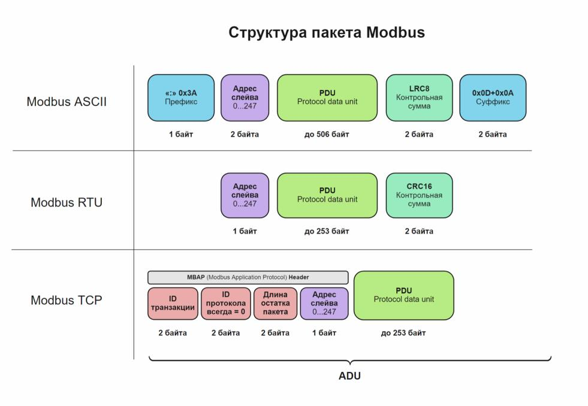

Использование протокола MODBUS TCP
==================================

Протокол Modbus — самый распространенный промышленный протокол для M2M-взаимодействия. Является стандартом де-факто и поддерживается почти всеми
производителями промышленного оборудования.

Обзор протокола
---------------

Физический уровень
~~~~~~~~~~~~~~~~~~

Протокол MODBUS TCP работает на физическом уровне с использованием стека протоколов TCP/IP. Это означает, что он использует стандартный ``Ethernet-кабель`` для подключения к сети и использует протокол ``TCP/IP`` для передачи данных.

MODBUS TCP работает по принципу ``клиент-серверной архитектуры``, где клиентское устройство (например, компьютер или контроллер) и серверное устройство (например, датчик или привод) общаются друг с другом посредством определенных сообщений, отправляемых через сеть.

Логический уровень
~~~~~~~~~~~~~~~~~~

Протокол MODBUS TCP работает на логическом уровне с использованием клиент-серверной модели передачи данных. Это означает, что клиентское устройство (например, компьютер или контроллер) отправляет запрос на серверное устройство (например, датчик или привод), который затем обрабатывает запрос и отправляет ответ обратно клиенту.

На логическом уровне, протокол MODBUS TCP использует различные функции для чтения и записи данных. Каждая функция имеет свой уникальный код, который определяет тип операции, которую необходимо выполнить. Например, функция ``чтения регистров`` имеет код 03, а функция ``записи регистров`` имеет код 06.

Формат пакета
~~~~~~~~~~~~~

Все устройства Modbus взаимодействуют, следуя модели ``master-slave``. Запросы может инициировать только master-устройство, ``slave-устройства`` могут только отвечать на запросы, и не могут самостоятельно начинать передачу данных. В зависимости от реализации протокола, заголовки пакета различаются. Вот основные составляющие пакета, которые важно знать:

1. ``ADU`` (Application Data Unit) — пакет Modbus целиком, со всеми заголовками, PDU, контрольной суммой, адресом и маркерами. Отличается, в зависимости от реализации протокола.

2. ``PDU`` (protocol data unit) — основная часть пакета, одинаковая для всех реализаций протокола. Содержит сам payload.

Вывод данных с датчиков теплицы по протоколу MODBUS TCP
-------------------------------------------------------

Программное обеспечение для вывода данных
~~~~~~~~~~~~~~~~~~~~~~~~~~~~~~~~~~~~~~~~~

Для вывода данных с датчиков, установленных в умной теплице, на локальный сервер и управления подвижными элементами теплицы, используется установленное на персональном компьютере программное обеспечение Node-RED, предоставляющее удобный интерфейс для построения логических связей между данными, получаемыми от датчиков в реальном времени, и теплицы

Установка библиотеки ModbusServerWiFi
"""""""""""""""""""""""""""""""""""""
Библиотеку ModbusServerWiFi можно найти и загрузить из Arduino IDE, используя менеджер библиотек. Это делается через меню "Инструменты" -> "Управление библиотеками".

Создание Modbus сервера на ESP32
""""""""""""""""""""""""""""""""

Этот код предоставляет основу для создания Modbus сервера на ESP32::

    #include <ModbusServerWiFi.h>
    #include <WiFi.h>

    // Параметры Wi-Fi
    const char* ssid = "Ваш_SSID";
    const char* password = "Ваш_пароль";

    // Создаем экземпляр сервера Modbus
    ModbusServerWiFi modbusServer;

    void setup() {
    // Инициализация Wi-Fi
    WiFi.begin(ssid, password);
    while (WiFi.status() != WL_CONNECTED) {
        delay(1000);
        Serial.println("Подключение к Wi-Fi...");
    }
    Serial.println("Подключено к Wi-Fi");

    // Настройка Modbus сервера
    modbusServer.begin(502); // Порт Modbus (стандартный - 502)

    // Добавление регистров Modbus
    // Здесь можно добавить свои регистры
    // Например:
    // modbusServer.addHoldingRegister(0, 0); // Добавление регистра хранения

    Serial.println("Modbus сервер запущен");
    }

    void loop() {
    // Обработка запросов Modbus
    modbusServer.poll();

    // Добавьте свой код здесь для обработки данных или событий
    }    

1. Код начинается с подключения ESP32 к Wi-Fi с использованием заданных SSID и пароля. Это позволяет устройству быть доступным в вашей локальной сети.

2. Инициализация Modbus сервера: Затем создается экземпляр Modbus сервера с указанием порта (стандартный порт Modbus - 502).

3. Добавление регистров Modbus: Вы можете добавить регистры Modbus (регистры хранения, входные регистры, катушки и дискретные входы) с помощью методов ``addHoldingRegister``, ``addInputRegister``, ``addCoil`` и ``addDiscreteInput``. Эти регистры используются для хранения и передачи данных между устройствами через протокол Modbus.

4. Обработка запросов Modbus: В основном цикле ``loop``, метод ``poll()`` вызывается для обработки входящих запросов Modbus от других устройств.

5. Добавление своего кода: Вы можете добавить свой собственный код в основной цикл ``loop`` для обработки данных или событий на устройстве. Например, вы можете считывать данные с датчиков.