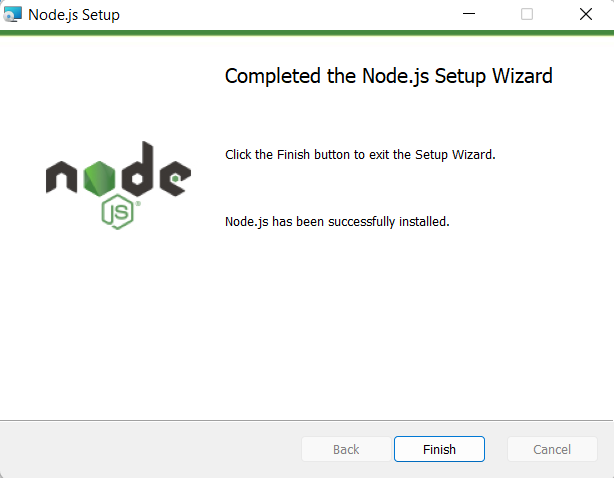
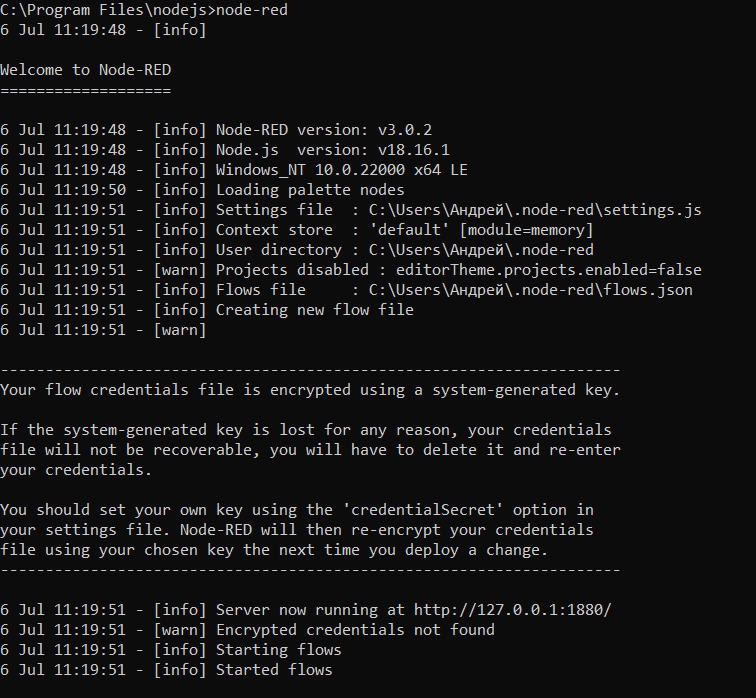
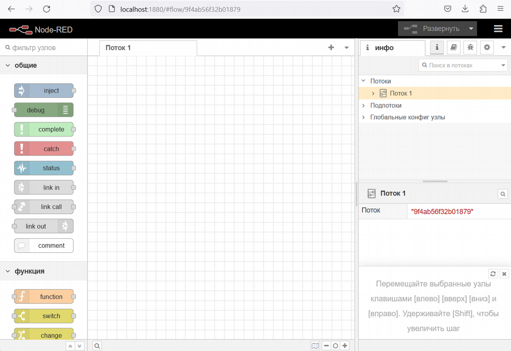

Настройка Node-red
==================

Установка
---------

1. Для установки Node-RED перейдём на официальный сайт продукта: ``https://nodered.org/``

2. На открывшейся странице нажмём на кнопку “Get Started”

3. Выберем вариант “Run locally” , “Getting started”

4. В открывшейся странице выберем вариант “Running locally” чтобы установить Node-RED на свой ПК

5. Выберем вариант установки для Windows или для любой другой операционной системы

Далее, следуя указаниям в инструкции по установке перейдите на страницу ``https://nodejs.org/en`` и скачайте .msi файл. После успешной установки вы увидите следующее сообщение. Кроме того, откроется консоль установки дополнительных инструментов Node.js

Откройте cmd, перейдите в каталог nodejs. Запустите процесс установки Node-RED. Для
этого введите следующий запрос::

  npm install -g --unsafe-perm node-red

.. figure:: images/2.png
       :width: 60%
       :align: center
       :alt: установка

Для запуска Node-RED введите команду:: 

  node-red

По умолчанию Node-RED запускается на адресе ``http://localhost:1880``. Откройте свой веббраузер и перейдите по этому адресу. Вы можете создавать свои потоки (flows) в Node-RED, используя визуальный интерфейс. Для этого нажмите на кнопку «Create a New Flow» на главной странице Node-RED. Для дополнительной настройки вы можете установить узлы (``nodes``) и плагины (``plugins``) Node-RED, используя менеджер пакетов ``npm``. Например, чтобы установить узел для работы с базой данных MongoDB, выполните команду::

  npm install node-red-contrib-mongodb

Изучение интерфейса Node-RED
----------------------------

Интерфейс Node-RED представляет собой веб-приложение, которое можно открыть в любом браузере.

Главная страница интерфейса содержит панель инструментов слева и рабочее пространство, где вы можете создавать и редактировать потоки данных (flows). В панели инструментов находятся узлы (nodes), которые могут быть перетаскиваны в рабочее пространство и связаны проводами (wires) для передачи данных между ними. Узлы могут выполнять различные функции, например, считывать данные из базы данных, обрабатывать данные, отправлять данные на другие устройства и т.д.

В меню также есть вкладка «Debug», где можно просмотреть данные, передаваемые между узлами в реальном времени.

Подключение к теплице
---------------------

