Программирование PolusLab
=========================

Обзор блока PolusLab
--------------------

Общая информация
~~~~~~~~~~~~~~~~

Цифровые лаборатории, представляют собой комплекты, выполненные на базе многофункциональных устройств регистрации и сбора данных ``LFS``, содержащих встроенные сенсорные устройства, подключаемые внешние датчики и цифровые интерфейсы для подключения внешних устройств, в том числе для коммуникации с внешними программируемыми контроллерами. 

Такое устройства блока позволяет использовать лабораторию как модуль робототехнической системы, в обязанности которой входит жесткий мониторинг таких состояний среды как относительная ``влажность``, ``pH``, ``атмосферное давление`` и т.п.

Беспроводной мультидатчик LFS представляет собой многофункциональное устройство регистрации и сбора данных. Он оснащен цветным сенсорным экраном для отображения числовой и графической информации о результатах измерений.

Для передачи результатов измерений на внешние ПК или мобильные устройства можно применить ``беспроводной протокол Bluetooth``. 

.. figure:: images/1.png
       :width: 50%
       :align: center
       :alt: PolusLab

Состав комплекта
~~~~~~~~~~~~~~~~

Рассматриваемый комплект ``Экология v1.0`` включает в себя набор датчиков:

1. Датчик атмосферного давления;

2. Датчик освещенности (люксметр);

3. Датчик относительной влажности;

4. Датчик УФ излучения и ИК излучения;

5. Датчик температуры воздуха;

6. Датчик температуры;

7. Датчик pH;

8. Датчик нитрат-ионов;

9. Датчик хлорид-ионов;

10. Электрод сравнения;

11. Датчик электрической проводимости;

12. Датчик влажности почвы;

13. Датчик мутности и оптической плотности (колориметр);

14. Датчик содержания СО;

15. Датчик звука.

На блоке расположено 16 разъемов:: 

    Левый бок:
    “F-коннектор”, Jack 5.5 и четыре Jack 3.5. 
    Правый бок:
    “F-коннектор” и четыре Jack 3.5. 
    Верх:
    Jack 3.5 и оптический порт для датчиков (б) и (г).
    Низ:
    Сетевой порт, mini USB и MX-5264-03. (Также здесь расположен микрофон)

Каждый разъем предназначен только под определенный датчик, а потому они обозначены условными значками с лицевой стороны. На ней же расположены сенсорный экран и ``три кнопки управления``.

Управление блоком и вывод данных
~~~~~~~~~~~~~~~~~~~~~~~~~~~~~~~~

Управление датчиками может осуществляться различными путями. 

Сам блок уже является компьютером, способным вывести пользователю данные, полученные с подключенного оборудования на сенсорный экран. Для этого достаточно включить блок и выбрать на экране ``датчик`` (который конечно же должен быть заранее включён в соответствующий ему разъем). Тогда после нажатия кнопки старт блок начнет строить график измерений и выводить мгновенное значение в режиме ``реального времени``. 

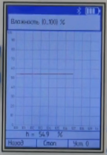

Блок и управляющая плата
~~~~~~~~~~~~~~~~~~~~~~~~

Наиболее трудный, но при этом универсальный метод снятия информации может быть реализован через подключение MX-5264-03 порт. Подключив через шину по протоколу DXL плату управления робототехнической системы, можно сделать цифровую лабораторию дополнительными или даже основными органами чувств робототехнического аппарата. Не совсем рационально делать это для коммерческой продукции, однако, на этапе проектирования и при обслуживании или проверки конечной продукции этот инструмент может оказаться незаменим.

Наш пример применения блока
~~~~~~~~~~~~~~~~~~~~~~~~~~~

У нас в доступе для исследования есть блок “Экология V1.0”. Применяться он будет в качестве средства ``мониторинга состояния среды Agrolab GH`` с автоматизированной системой климат контроля (температура, состав атмосферы, состав почвы, освещенность и др.). Так как участие человека планируется минимальным, а система по своей сути представляет робота, то наиболее подходящий метод снятия информации – протокол DXL. Возможности цифровой лаборатории позволяют осуществить:

- создание необходимой прошивки для платы в самом начале проекта;

- проверку достаточности используемых методов наблюдения за средой, калибровку и подбор необходимых настроек датчиков;

- проверку возможностей готовой Agrolab GH до установки постоянных датчиков;

- долгосрочный полевой эксперимент с возможностью удаленного наблюдения.

- сверку результатов измерений на заключительном этапе сборки проекта путем дублирования датчиков и средств обработки информации.  

Настройка блока (прошивка, подключение и пр.)
---------------------------------------------

Перепрошивка — это процесс установки или обновления прошивки или программного обеспечения в системе PolusLab. Крайне важно поддерживать систему в актуальном состоянии с помощью последних функций, исправлений ошибок и исправлений безопасности. Перепрошивка также позволяет устанавливать новые модули, приложения или системные компоненты.

Прошивка системы «PolusLab»
~~~~~~~~~~~~~~~~~~~~~~~~~~~

Процесс перепрошивки обычно включает в себя подключение системы PolusLab к компьютеру, запуск специального программного обеспечения или команд перепрошивки и выполнение пошаговых инструкций, предоставленных производителем. Пользователи должны обращать внимание на любые предупреждения или подсказки во время процесса перепрошивки и не прерывать операцию до ее завершения.

Проверка прошитой системы
~~~~~~~~~~~~~~~~~~~~~~~~~

После завершения процесса перепрошивки крайне важно убедиться в успешной установке или обновлении прошивки или программного обеспечения. Это можно сделать, проведя функциональные тесты, убедившись, что все функции и модули работают правильно, и проверив стабильность системы. Проверка необходима для обеспечения готовности системы PolusLab к экспериментам и моделированию.

Советы по эффективному процессу прошивки
~~~~~~~~~~~~~~~~~~~~~~~~~~~~~~~~~~~~~~~~

Чтобы повысить эффективность процесса перепрошивки, в этом разделе приведены советы и рекомендации. К ним относятся резервное копирование данных перед прошивкой, отключение ненужных приложений, обеспечение стабильного питания и точное соблюдение рекомендаций производителя. Соблюдение этих рекомендаций минимизирует потенциальные проблемы и оптимизирует процесс перепрошивки.

Использование веб интерфейса
----------------------------

Возможности предоставляющие веб-интерфейс
~~~~~~~~~~~~~~~~~~~~~~~~~~~~~~~~~~~~~~~~~

Вот некоторые из возможностей, которые предоставляет веб-интерфейс PolusLab:

1. ``Мониторинг и управление параметрами окружающей среды:`` Веб-интерфейс PolusLab позволяет мониторить и управлять параметрами окружающей среды в Agrolab GH, такими как температура, влажность и освещенность.

2. ``Управление системами полива и удобрения:`` С помощью веб-интерфейса PolusLab можно управлять системами полива и удобрения, включая назначение расписания полива и дозировку удобрений.

3. ``Мониторинг состояния растений:`` Веб-интерфейс PolusLab позволяет мониторить состояние растений в Agrolab GH, включая их рост, здоровье и физические характеристики.

4. ``Управление освещением:`` Веб-интерфейс PolusLab позволяет управлять системами освещения в Agrolab GH, включая назначение расписания освещения и регулировку его интенсивности.

5. ``Отчетность и аналитика:`` Веб-интерфейс PolusLab предоставляет отчеты и аналитику по производительности Agrolab GH, включая данные о росте растений, использовании ресурсов и эффективности систем управления.

6. ``Управление устройствами удаленно:`` Веб-интерфейс PolusLab позволяет управлять устройствами Agrolab GH удаленно, что позволяет управлять из любой точки мира с доступом в Интернет.

7. ``Настраиваемость:`` Веб-интерфейс PolusLab настраиваем и может быть адаптирован под конкретные потребности пользователя, что обеспечивает максимальную гибкость и удобство использования.

Порядок действий:
~~~~~~~~~~~~~~~~~

Для начала работы с веб-интерфейсом PolusLab вам потребуется msi файл программы.

1. Запустите .msi файл

2. Нажмите кнопку «Начать»

3. Выберите тип подключения к устройствам: Bluetooth или по USB

4. Включите блок

5. Дождитесь пока блок будет обнаружен

6. Включите все датчики, данные с которых хотите замерить

7. В настройках можно выставить интервал, через который будут проводиться измерения

8. Запустите эксперимент

9. Данные можно сохранять в .xlsx файл

Пример
~~~~~~

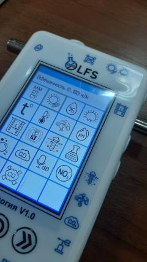

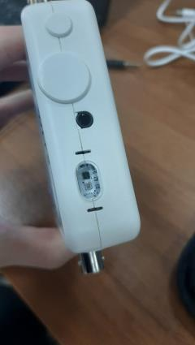

|pic1| |pic2|

Я использовал датчик освещённости, встроенный в блок, чтобы продемонстрировать пример работы программы веб интерфейся Polus Lab. Следуя вышеописанному плану, я провёл эксперимен, поочерёдно то освещая люксометр фонариком телефона, то закрывая его пальцем. Результаты представлены ниже

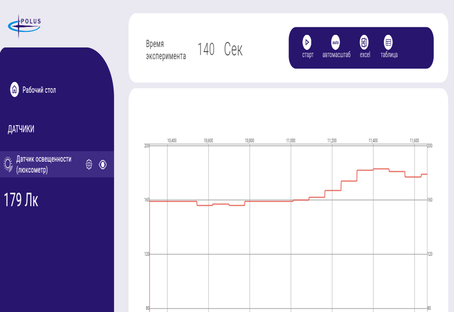

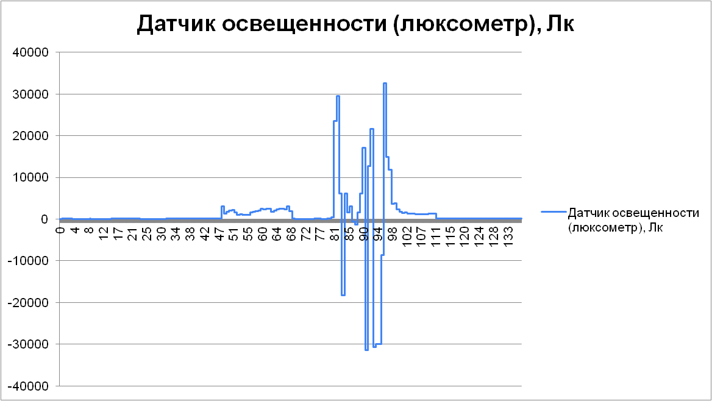

|pic3| |pic4|

Датчик PH
---------

В различных химических средах может происходить процесс диссоциации химических соединений, будь то ``соль``, ``кислота`` или ``щелочь``. Данное явление заключается в распаде исходных молекул вещества на противоположно заряженные ионы, одним из которых может быть ``катион водорода H``. Отслеживая число этих ионов в объеме среды, можно определить такой её параметр, как кислотность. Живые организмы, устройство которых основана на химических взаимодействиях, очень зависимы от этих показателей, поэтому их ``необходимо учитывать`` при взращивании растительных культур. Для этого можно применить химические методы анализа, но удобнее воспользоваться электронным устройством вроде ``датчика pH``.

Устройство датчика
~~~~~~~~~~~~~~~~~~

Действие pH-метра основано на измерении величины ЭДС электродной системы, которая пропорциональна активности ионов водорода в растворе. То есть, измерительная схема, по сути, представляет собой вольтметр, проградуированный непосредственно в единицах pH, так как зависимость напряжения и кислотности прямая.

Входное сопротивление прибора должно быть не менее 1011 Ом, а входной ток не более 10 :sup:`11` А. 

В состав прибора обычно входит три электрода: ``измерительный``, ``индикаторный`` и ``вспомогательный``. 

- Измерительный реагирует на ионы водорода. Измерительные электроды сделаны из боросиликатного стекла, которое не боится окислителей. Но в то же время, борсиликат достаточно тонкий и электропроводный.

- Индикаторный электрод имеет вид трубки с шариком на конце. Трубка наполняется смесью хлорида серебра и соляной кислоты. В эту суспензию помещается серебряная проволока, выполняющая роль электрода. В трубке перемещаются положительно заряженные ионы водорода.

- Вспомогательный (или электрод сравнения) выглядит как ртутно-каломелевая паста, которая помещена в хлорид калия. Раствор хлорида калия выполняет роль проводника между исследуемой средой и пастой. Работает в паре с индикаторным электродом.

Современные рН-метры обычно совмещают в одном корпусе измерительные и вспомогательные электроды. Это позволяет производить измерения быстро, с минимальными погрешностями.

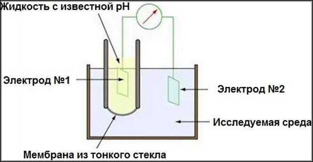

Калибровка датчика
~~~~~~~~~~~~~~~~~~

Строение датчика предполагает необходимость задания определенных значений в настройке для исправной работы. Для этого перед введением датчика в эксплуатацию требуется провести калибровку на минимум двух растворах с известными значениями кислотности. Так как наблюдается прямая зависимость между ``ЭДС`` в среде и показателем pH, то по двум известным значениям можно провести настройку

Важной деталью является влияние температуры среды. Её перепады могут вносить определённую погрешность в показания прибора.

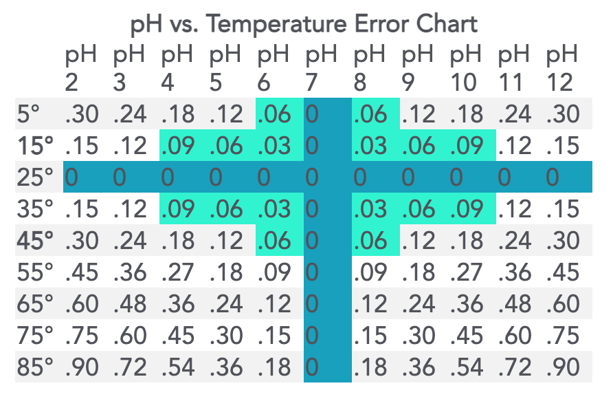

**Примечание:** значения, выделенные голубым цветом, соответствуют погрешности менее 0,1 и могут не требовать температурной компенсации. Значения, выделенные темно-синим цветом — это температура и pH, при которых нет погрешности измерения pH в зависимости от температуры.

Большинство измерителей, контроллеров и других приборов облегчают этот процесс. 

Датчик от цифровой лаборатории LFS.
~~~~~~~~~~~~~~~~~~~~~~~~~~~~~~~~~~~

В комплекте лаборатории есть 2 датчика pH: для раствора и для почвы.

**Датчик pH раствора**

В рабочей части датчика расположен стеклянный шарик – измерительный электрод. Именно он погружается в раствор и снимает показания индуцируемого в нем потенциала

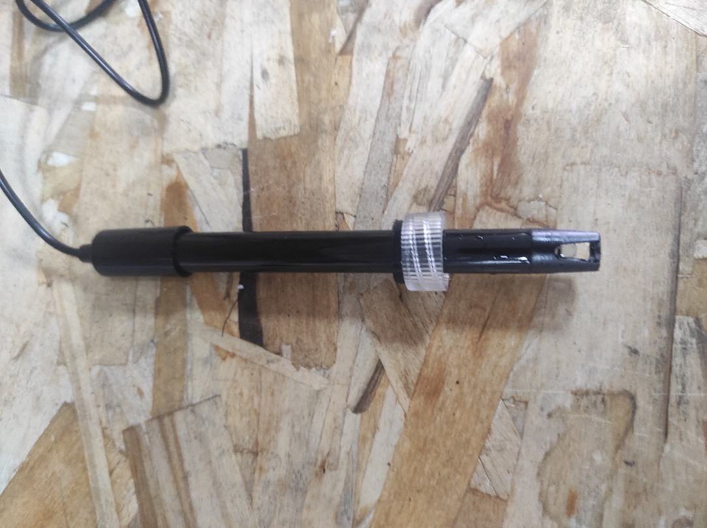

Результаты измерений после взятия датчика в изучаемый раствор. График приобретает вид прямой, так как значение pH в растворе не меняется. 

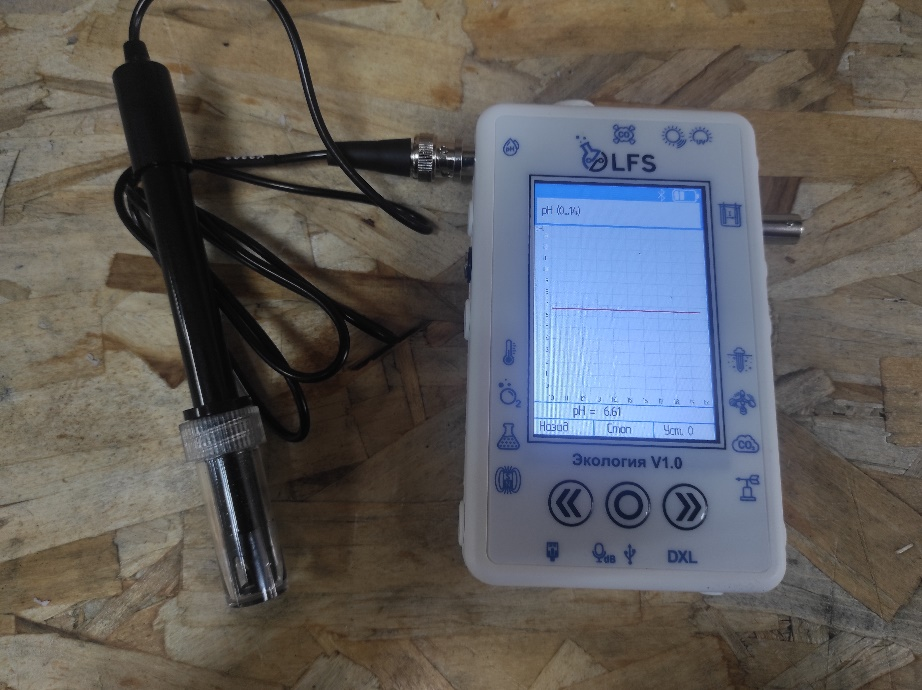

Датчик ионов 
------------

При определении состава какого-либо раствора можно прибегнуть к химическому методу, где в зависимости от внешних признаков, возникших после реакции, определяется количественный и качественный состав. Но также можно применить ``датчик ионов``, который не только будет реагировать только на определённые ионы, но и определять количественное содержание. 

Устройство датчика
~~~~~~~~~~~~~~~~~~

Датчик состоит из ионоселективного и токоотводящего электродов. 

Важнейшей составной частью ионообменных электродов является ``полупроницаемая мембрана``, которая представляет собой тонкую пленку, отделяющую внутреннюю часть ``электрода`` (где находится вспомогательный, внутренний раствор) от ``анализируемого раствора``. Мембрана называется полупроницаемой, потому что обеспечивает прохождение через неё ионов одного знака (катионов или анионов), и, преимущественно, ионов одного сорта в присутствии других ионов с тем же знаком заряда. Это обеспечивает достаточно высокую селективность мембраны.

Внутри электрода находится раствор с постоянной концентрацией тех ионов, на проверку которых рассчитан датчик. Мембрана к ним селективна. Также в растворе содержаться ионы, обеспечивающие ``потенциал вспомогательного токоотводящего электрода``. 

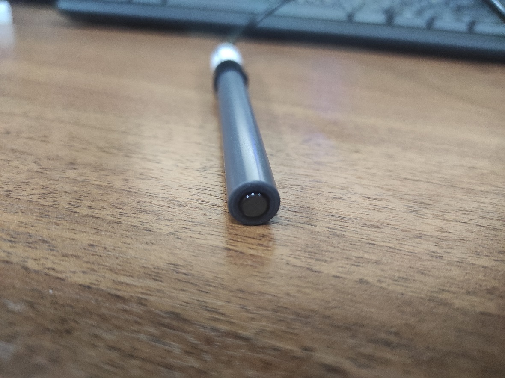

Мембраны изготавливают из различных материалов, а классифицируют по их агрегатному состоянию: ``твердые``, ``жидкие`` и ``газочувствительные``. 

Твердые мембраны изготавливают из малорастворимого кристаллического вещества с ионным характером проводимости. Селективность твердых кристаллических мембранных электродов обусловлена вакансионным механизмом переноса заряда. Вакансии заполняются только определенными подвижными ионами в соответствии с их характеристиками (форма, размер, распределение заряда вакансии).

В настоящее время электроды с твердыми кристаллическими мембранами изготавливают и без внутреннего раствора, используя прямой контакт металлического проводника и мембраны. Такие электроды называют твердотельными (или электродами с твердым контактом), они значительно удобнее в работе, чем электроды с внутренними растворами.

Жидкая мембрана — это слой жидкого органического вещества, которое не должно растворяться в исследуемом растворе. Устойчивость мембраны повышается, если органическая жидкость обладает ещё и ``высокой вязкостью``.

Система газового электрода включает ионоселективный электрод и электрод сравнения, контактирующие с небольшим объемом вспомогательного (приэлектродного) раствора. Этот раствор отделен от исследуемого раствора прослойкой или гидрофобной газопроницаемой мембраной.

Электродом сравнения может быть ``электрод II рода`` в растворе электролита с анионом малорастворимой соли.

Потенциал электрода сравнения служит точкой отсчета, по отношению к которой измеряют потенциал индикаторного (ионоселективного) электрода. Но и индикаторный электрод, в принципе, может служить также и электродом сравнения, если создать условия, при которых потенциал такого индикаторного электрода остается неизменным в процессе анализа.

Универсальным электродом сравнения является стандартный ``водородный электрод``, но для практической работы он неудобен из-за необходимости использования очень чистого водорода и ряда других причин.

.. figure:: images/14.jpeg
       :width: 45%
       :align: center
       :alt: Сравнительный электрод комплекта PolusLab 

       Сравнительный электрод комплекта PolusLab

Принцип работы
~~~~~~~~~~~~~~

Рассмотрим пример при детектировании катиона кальция.

Если полупроницаемую мембрану поместить между двумя растворами с разными концентрациями определяемого катиона К :sup:`+` :sub:`1`, то на внешней и внутренней поверхностях мембраны будет происходить обмен этими катионами как в прямом, так и в обратном направлениях, т.е. катионы из раствора будут проникать в фазу мембраны и обратно (для других катионов, например, K :sup:`+` :sub:`2`, и анионов А :sup:`-` мембрана непроницаема). На Рис.3 представлено схематическое изображение мембранной ячейки, являющейся частью мембранного ионоселективного электрода.

+----------------------------------------------------+-------------------------------------------------+
| .. figure:: images/15.png                          | 1 – мембрана                                    |
|        :width: 60%                                 |                                                 |
|                                                    | 2 - внешний (анализируемый) раствор             |
|                                                    |                                                 |
|                                                    | 3, 4 – внешний и внутренний электроды сравнения |
|                                                    |                                                 |
| Рис.3. Схематическое изображение мембранной ячейки | 5 – внутренний (стандартный) раствор            |
|                                                    |                                                 |                             
|                                                    |                                                 |                         
+----------------------------------------------------+-------------------------------------------------+

Различие в концентрации ионов в обоих растворах определяет скорость обмена. Если концентрации различны, то в растворе и в фазе мембраны возникают потенциалы на обеих поверхностях мембраны.

Через какое-то время устанавливается динамическое равновесие. Так как концентрация внутри электрода не меняется, то возникающая разница потенциалов зависит только от концентрации исследуемого раствора.

Суть процесса практически такой же независимо от используемой в ионоселективном электроде мембраны. 

Датчик электропроводности жидкости
----------------------------------

Датчик электропроводности жидкости PolusLab — это современное устройство, предназначенное для точного измерения электропроводности жидкостей. Он использует передовые технологии и инновационные функции для получения точных показаний в режиме реального времени, что делает его важным инструментом для промышленности и исследовательских лабораторий.

Принцип работы
~~~~~~~~~~~~~~

Датчик работает по принципу измерения электропроводности жидкости. Он состоит из ``пары электродов``, обычно изготовленных из нержавеющей ``стали`` или ``графита``, которые погружаются в жидкость. Через жидкость между электродами проходит электрический ток, и датчик ``измеряет сопротивление`` этому току. По закону Ома сопротивление обратно пропорционально проводимости. Таким образом, датчик рассчитывает электропроводность жидкости на основе измеренного сопротивления.

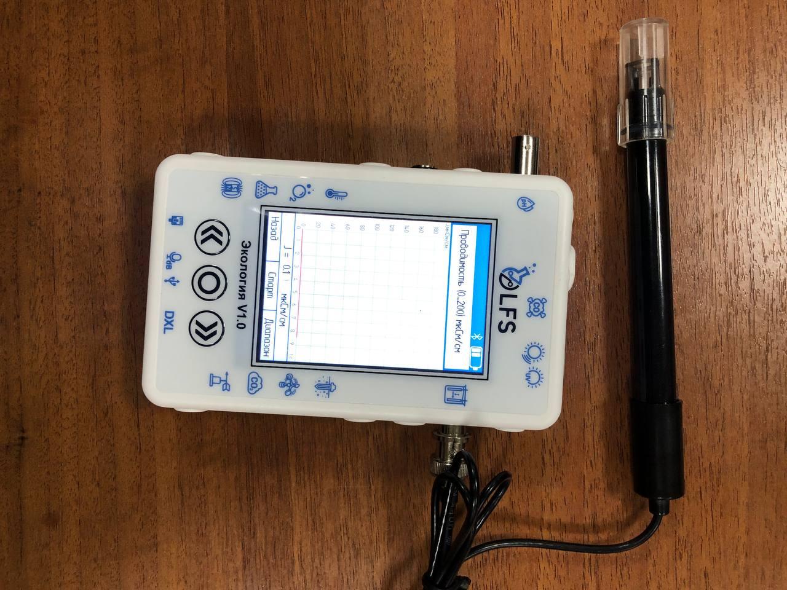

Технические характеристики
~~~~~~~~~~~~~~~~~~~~~~~~~~

Датчик проводимости жидкости PolusLab может похвастаться несколькими техническими характеристиками, которые способствуют его точности и надежности. Некоторые из ключевых спецификаций включают в себя:

- ``Диапазон измерения:`` датчик предлагает широкий диапазон измерений, обычно от 0,1 мкСм/см до 2000 мСм/см.

- ``Точность:`` датчик обеспечивает высокую точность с отклонениями обычно менее 1% от значения полной шкалы.

- ``Температурная компенсация:`` Датчик включает температурную компенсацию, обеспечивая точные показания даже в различных температурных условиях.

- ``Время отклика:`` время отклика датчика обычно составляет менее одной секунды, что обеспечивает мониторинг в реальном времени и быструю обратную связь.

- ``Выход:`` датчик имеет аналоговый или цифровой выход, что обеспечивает бесшовную интеграцию с различными системами мониторинга.

Модуль измерения оптической плотности и мутности
------------------------------------------------

Измерения оптической плотности и мутности имеют решающее значение в различных научных, промышленных и экологических приложениях. Целью этого отчета является обсуждение разработки и функциональности модуля, разработанного специально для точных и точных измерений оптической плотности и мутности. Модуль использует передовые методы оптического измерения для определения концентрации частиц в образце. В отчете представлен обзор принципов, лежащих в основе измерений оптической плотности и мутности, объяснение конструкции модуля и механизма работы, его потенциальных применений, а также обсуждение его преимуществ и ограничений.

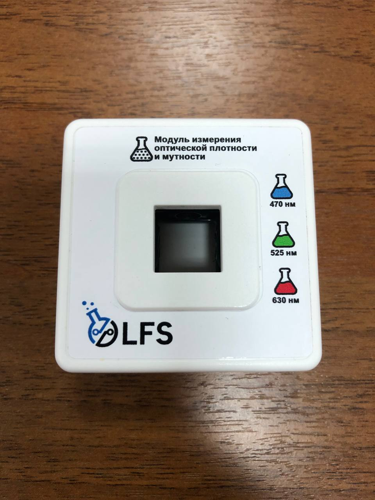

Принципы измерения оптической плотности и мутности:
~~~~~~~~~~~~~~~~~~~~~~~~~~~~~~~~~~~~~~~~~~~~~~~~~~~

Оптическая плотность относится к мере поглощения света образцом, а мутность представляет собой рассеяние света из-за присутствия частиц в образце. Оба измерения важны для характеристики концентрации и качества взвешенных частиц. Оптическую плотность обычно измеряют с помощью спектрофотометрии, а мутность определяют путем оценки интенсивности рассеянного света 

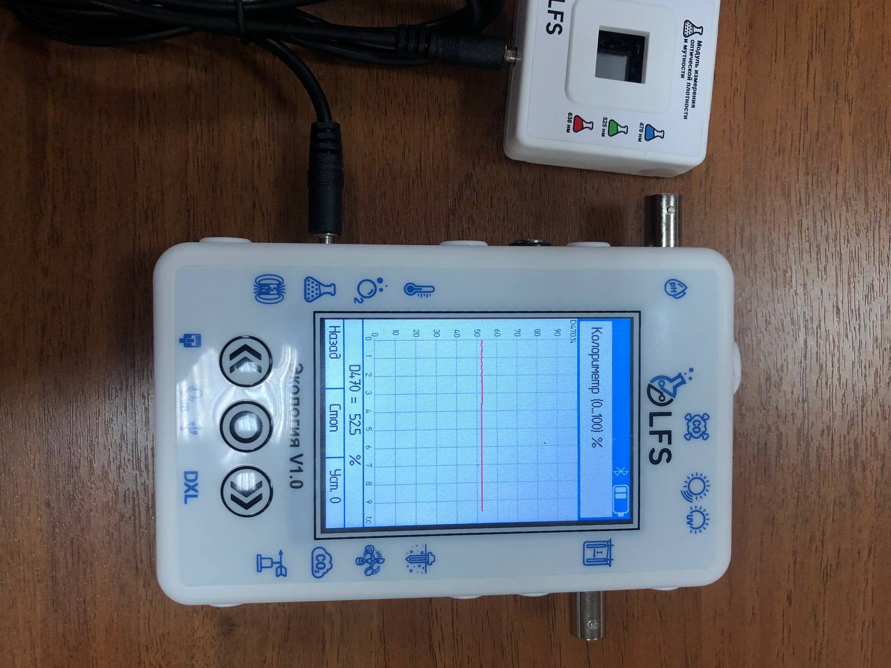

Конструкция и рабочий механизм модуля:
~~~~~~~~~~~~~~~~~~~~~~~~~~~~~~~~~~~~~~

Модуль измерения оптической плотности и мутности состоит из оптического датчика, источника света, камеры для проб и системы сбора данных. Источник света излучает луч света, который проходит через камеру для образца, содержащую жидкий образец. Оптический датчик обнаруживает либо поглощенный свет для измерения оптической плотности, либо рассеянный свет для измерения мутности. Система сбора данных записывает обнаруженную интенсивность света и преобразует ее в соответствующие значения оптической плотности или мутности.

Применение модуля:
~~~~~~~~~~~~~~~~~~

Модуль измерения оптической плотности и мутности находит применение в самых разных отраслях промышленности и научных исследованиях. Приложения для мониторинга окружающей среды включают оценку качества воды, обнаружение загрязняющих веществ и анализ присутствия взвешенных твердых частиц. Кроме того, пищевая промышленность и производство напитков полагаются на этот модуль для обеспечения качества в ходе производственных процессов.

Температурный датчик
--------------------

Измерение температуры играет решающую роль в различных отраслях и приложениях, включая производство, здравоохранение и мониторинг окружающей среды. PolusLab, завоевавшая доверие множества организаций, является производителем цифровых лабораторий, поставщиком информационных и образовательных технологий для повышения качества образовательного процесса. Разработала усовершенствованный датчик температуры, который обеспечивает точные и надежные измерения температуры. В этом отчете представлен всесторонний анализ датчика температуры от PolusLab с выделением его функций, преимуществ и возможных областей применения.

Характеристики датчика температуры PolusLab:
~~~~~~~~~~~~~~~~~~~~~~~~~~~~~~~~~~~~~~~~~~~~

1. Датчик температуры PolusLab оснащен несколькими дополнительными функциями, которые отличают его от обычных датчиков температуры. Некоторые ключевые особенности включают в себя:

2. Высокая точность: датчик температуры обеспечивает точные измерения температуры в узком диапазоне допусков, обеспечивая получение надежных данных для критически важных приложений.

3. Широкий диапазон температур: датчик работает в широком диапазоне температур, что позволяет ему работать в экстремальных условиях без ущерба для производительности.

4. Быстрое время отклика: датчик температуры обеспечивает быстрое время отклика, что позволяет контролировать и контролировать температуру в режиме реального времени.

5. Низкое энергопотребление: датчик температуры PolusLab спроектирован так, чтобы свести к минимуму энергопотребление, что делает его пригодным для устройств с батарейным питанием и энергоэффективных приложений.

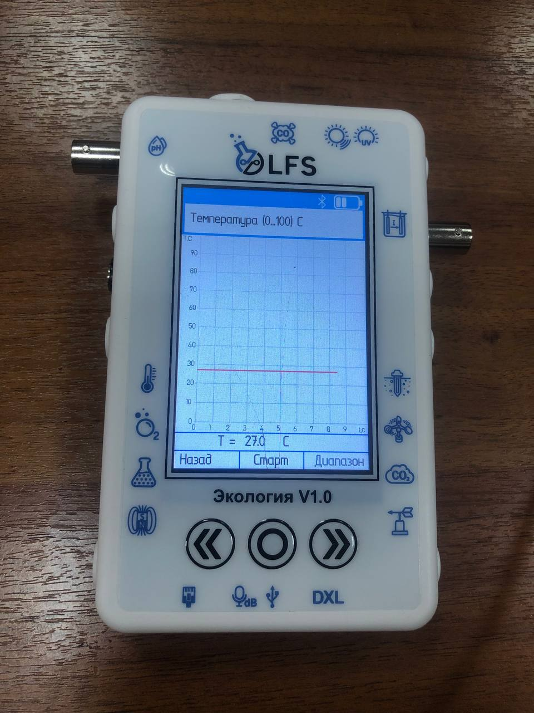

Датчик влажности почвы
----------------------

Влажность почвы характеризуется количеством воды, содержащейся в почве в момент определения. Различают влажность ``абсолютную`` и ``относительную``.

Абсолютной влажностью называется содержание воды в процентах к массе (весу) или объему сухой почвы. Для определения абсолютной влажности навеску почвы высушивают до постоянной массы и рассчитывают по формуле: М :sub:`m` = М :sub:`в` / М :sub:`п` ⋅ 100%, где

- М :sub:`m` - абсолютная массовая влажность в процентах;

- М :sub:`в` - масса воды в образце;

- М :sub:`п` - масса сухой почвы;

- 100 - коэффициент для расчета в процентах

Относительная влажность — это отношение содержания влаги в данный момент к количеству воды, насыщающей почву до её наименьшей влагоемкости. Относительная влажность рассчитывается по формуле: W :sub:`отн` = W :sub:`абс` ⋅ 100% / НВ, где

- W :sub:`отн` - относительная влажность;
- W :sub:`абс` - абсолютная влажность;
- НВ - наименьшая влагоемкость;
- 100 - коэффициент для расчета в процентах.

Относительная влажность характеризует степень насыщенности почвы водой по сравнению с пористостью или наименьшей влагоемкостью.

Устройство датчика влажности почвы
~~~~~~~~~~~~~~~~~~~~~~~~~~~~~~~~~~

Широкое распространение получили два типа датчиков: ``резистивный`` и ``ёмкостной``

**Резистивный**

Резистивный датчик имеет простейшее устройство ``в виде вилки`` двух незамкнутых друг на друга контактов. Он погружается в почву, где влага замыкает цепь, и по ней начинает течь ток. Значение тока будет зависеть от проводимости почвы, а проводимость от относительной влажности. 

Такой датчик очень дешев и прост в использовании и устройстве, однако, открытые контакты подвержены эрозии не только со стороны агрессивной среды, но и процесса электролиза. 

Ускоренное старение контактов приводит не только к скорому выводу из строй датчика, но и быстро сбивает калибровку в процессе эксплуатации.

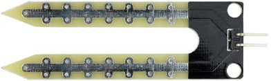

**Ёмкостный**

Устройство этого датчика несколько сложнее. Он представляет из себя

Конденсатор необычной формы, обкладки которого расположены в текстолитовой пластинке, что обеспечивает защиту от агрессивной химической среды.

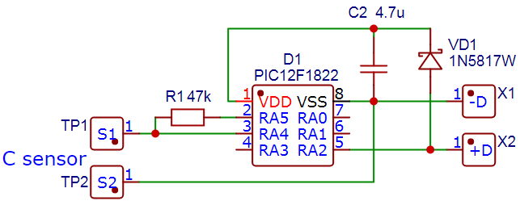
  

Принцип измерения основан на заряде ёмкости через резистор с фиксированным сопротивлением, срабатывании компаратора по достижению заданного значения и измерении длительности импульса на выходе компаратора.

В качестве источника заряда измеряемой емкости используется напряжение питания, а порог срабатывания компаратора формируется из того же напряжения резисторным делителем. Таким образом, изменение напряжения питания не влияет на точность измерения емкости

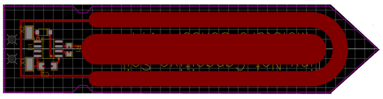

Рассмотрим датчик влажности почвы, входящий в состав комплекта цифровой лаборатории.

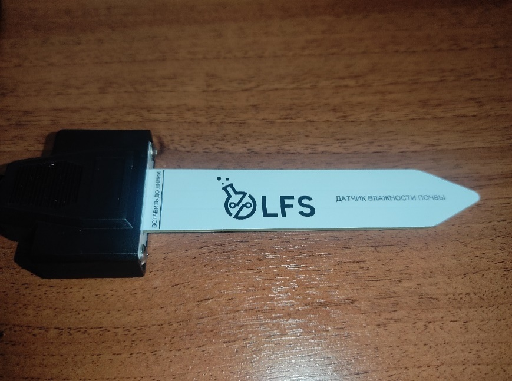

Очевидно, что он ёмкостного вида. Погружаемая в почву часть выполнена из текстолита, внутри которого можно разглядеть обкладки конденсатора. На ней есть линия, до которой датчик должен быть введен, чтобы изменить диэлектрическую проницаемость среды на всей площади взаимодействия обкладок.

Работоспособность устройства можно проверить, взяв его в руки. Это изменить проводимость внешней среды, что тут же можно будет увидеть на экране блока управления.

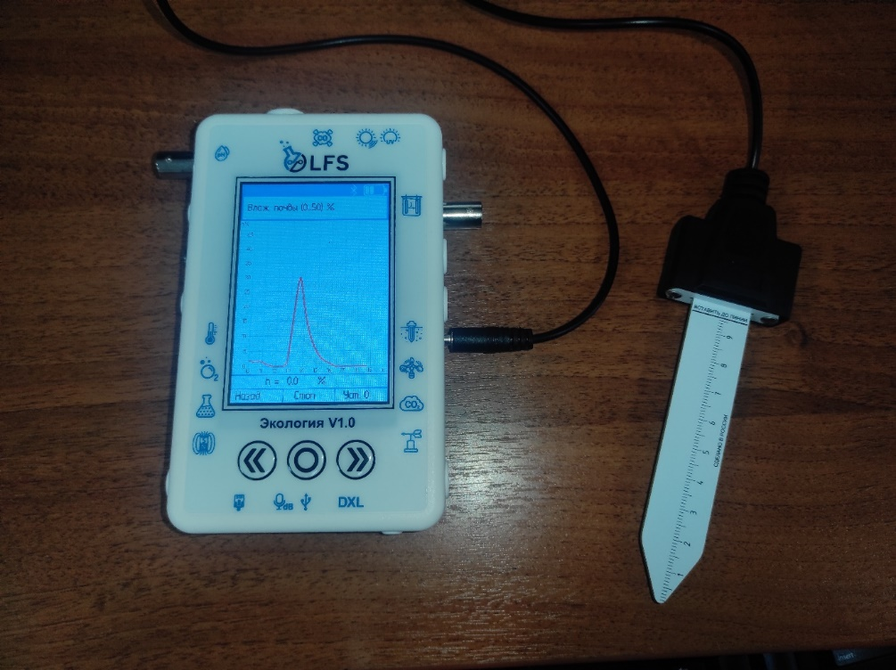

Модуль измерения содержания CO (окиси углерода)
-----------------------------------------------

Модуль измерения содержания CO (окиси углерода) является важной компонентой в системах контроля и мониторинга качества воздуха. CO является опасным газом, который может присутствовать в атмосфере в результате сгорания топлива. Его высокая концентрация может быть вредной для здоровья человека и окружающей среды. Модуль измерения CO позволяет точно измерять и контролировать уровень окиси углерода в окружающей среде.

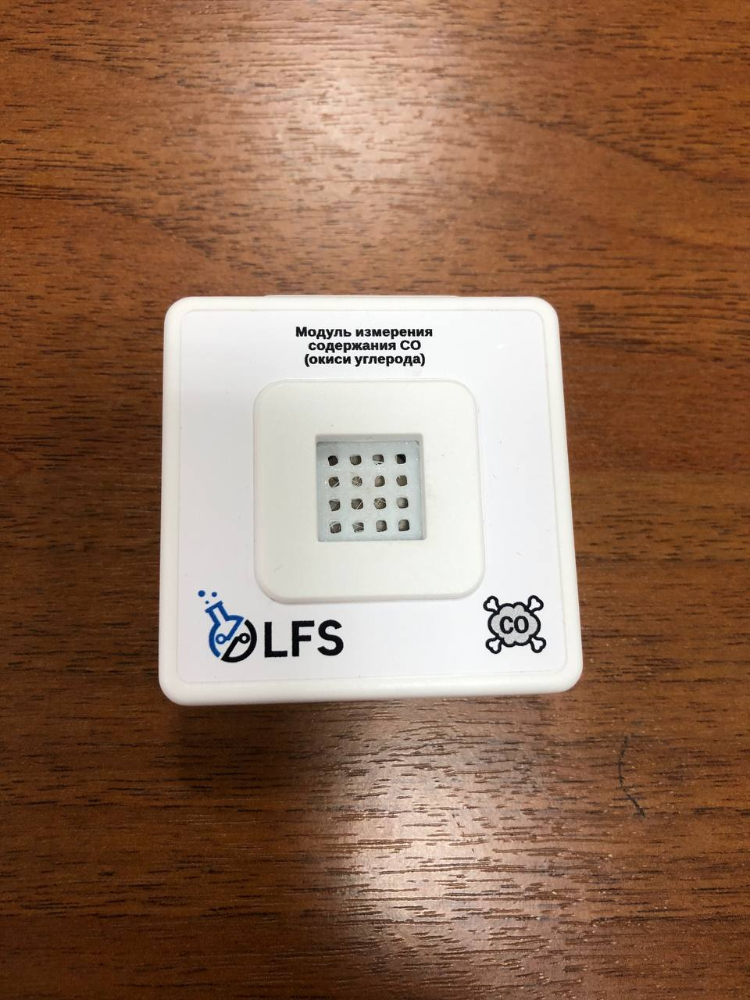

Принципы работы модуля измерения содержания CO:
~~~~~~~~~~~~~~~~~~~~~~~~~~~~~~~~~~~~~~~~~~~~~~~

Принцип действия основан на окислении одного из контактов электролитической ванны при появлении молекул CO в воздухе.

Молекулы отравляющего вещества способствуют усилению электролитической химической реакции, в результате чего на контактах образуется напряжение. Чем больше концентрация угарного газа, тем выше и напряжение. Если допустимое значение вредных веществ будет превышено, то прибор подаст сигнал тревоги

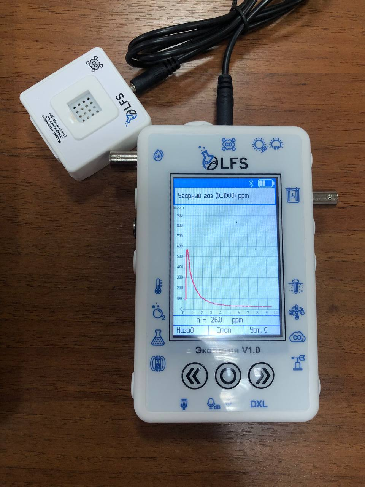

Виды датчиков угарного газа СО
~~~~~~~~~~~~~~~~~~~~~~~~~~~~~~

При классификации датчиков-сигнализаторов угарного газа учитывают принцип и способ обнаружения концентрации опасных паров в воздушной среде. 

Выделяют три вида сенсоров:

**Полупроводниковые определители угарного газа**

Полупроводниковые датчики дыма и угарного газа работают по принципу реагирования на изменение электрической проводимости воздуха в помещении из-за включения в его состав молекул CO. Их устройство очень простое: внутри датчика находятся контакты из диоксида олова или рутения, к которым подведен ТЭН, нагревающий контакты до 250°С. При нагреве контактов молекулы монооксида углерода (СО) влияют на атомы кислорода, в результате чего образуются электроны, которые в последующем вызывают воздушный пробой. Он и приводит к замыканию цепи газоанализатора. Если в воздухе нет молекул СО, датчик не срабатывает.

**Инфракрасные**

Принцип работы газоанализатора инфракрасного типа – изменение длины волны излучения в инфракрасной части спектра. Действие основано на спектре поглощения газами света. ИК излучение работает как раз на поглощение молекул монооксида углерода.

**Каталитические**

Принцип работы газоанализатора инфракрасного типа – изменение длины волны излучения в инфракрасной части спектра. Действие основано на спектре поглощения газами света. ИК излучение работает как раз на поглощение молекул монооксида углерода

Датчик освещенности
-------------------

Датчики света — это электронные устройства, которые обнаруживают и измеряют интенсивность света в непосредственной близости от них. Они имеют широкий спектр применения в различных отраслях, включая автомобилестроение, бытовую электронику, промышленную автоматизацию и системы умного дома. PolusLab, известная технологическая компания, разработала передовой датчик освещенности, который обеспечивает исключительную точность, надежность и эффективность.

Принцип работы:
~~~~~~~~~~~~~~~

Датчик света «PolusLab» использует чувствительный механизм на основе фотодиода. ``Фотодиоды`` — это полупроводниковые устройства, преобразующие световую энергию в электрический ток. При воздействии света фотодиод генерирует ток, пропорциональный интенсивности падающего света. Схема датчика освещенности усиливает этот ток и преобразует его в ``сигнал напряжения``, который можно дополнительно обрабатывать для различных приложений.

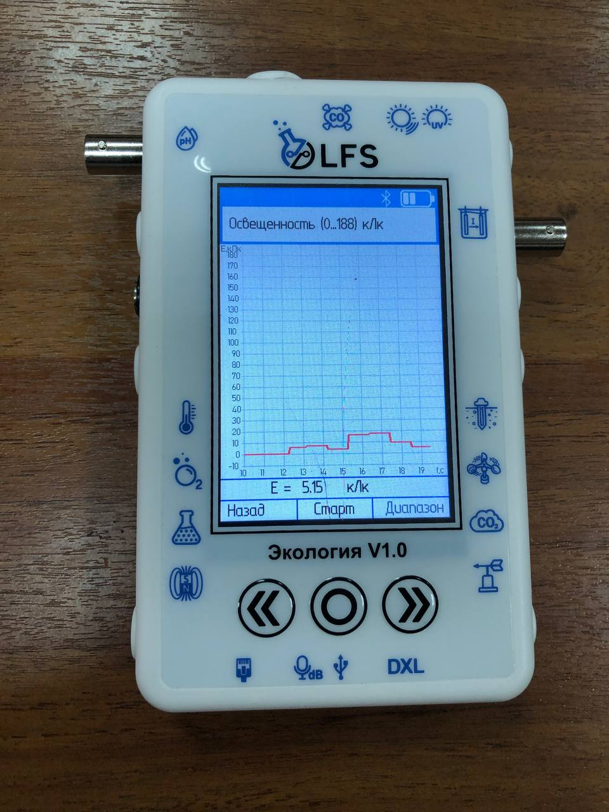

Основные характеристики:
~~~~~~~~~~~~~~~~~~~~~~~~

- Диапазон чувствительности: от 0,01 до 100 000 люкс (настраивается)

- Спектральный отклик: от 380 нм до 780 нм

- Напряжение питания: от 2,7 В до 5,5 В

- Выход: аналоговое напряжение, цифровой выход (настраиваемый)

- Пакет: Компактный пакет для поверхностного монтажа

- Диапазон рабочих температур: от -40°C до 85°C

- Время отклика: < 10 мс

