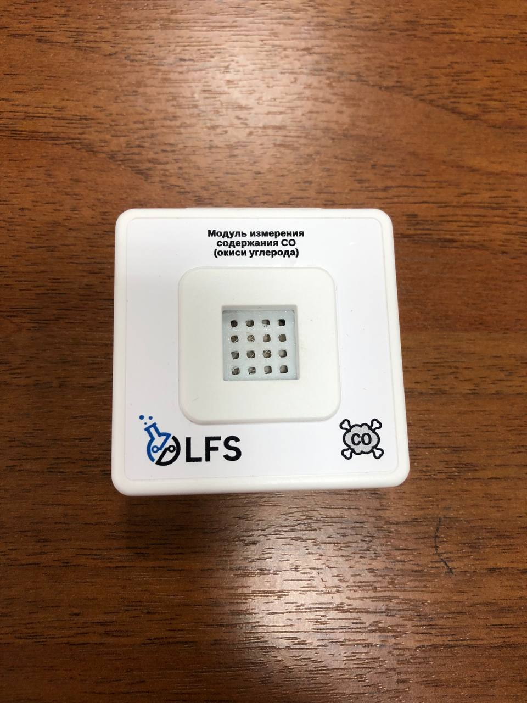

Модуль измерения содержания CO (окиси углерода)
-----------------------------------------------

Модуль измерения содержания CO (окиси углерода) является важной компонентой в системах контроля и мониторинга качества воздуха. CO является опасным газом, который может присутствовать в атмосфере в результате сгорания топлива. Его высокая концентрация может быть вредной для здоровья человека и окружающей среды. Модуль измерения CO позволяет точно измерять и контролировать уровень окиси углерода в окружающей среде.

Принципы работы модуля измерения содержания CO:
~~~~~~~~~~~~~~~~~~~~~~~~~~~~~~~~~~~~~~~~~~~~~~~

Принцип действия основан на окислении одного из контактов электролитической ванны при появлении молекул CO в воздухе.

Молекулы отравляющего вещества способствуют усилению электролитической химической реакции, в результате чего на контактах образуется напряжение. Чем больше концентрация угарного газа, тем выше и напряжение. Если допустимое значение вредных веществ будет превышено, то прибор подаст сигнал тревоги

.. figure:: images/26.png
       :width: 40%
       :align: center
       :alt: Модуль измерения содержания CO

Виды датчиков угарного газа СО
~~~~~~~~~~~~~~~~~~~~~~~~~~~~~~

При классификации датчиков-сигнализаторов угарного газа учитывают принцип и способ обнаружения концентрации опасных паров в воздушной среде. 

Выделяют три вида сенсоров:

**Полупроводниковые определители угарного газа**

Полупроводниковые датчики дыма и угарного газа работают по принципу реагирования на изменение электрической проводимости воздуха в помещении из-за включения в его состав молекул CO. Их устройство очень простое: внутри датчика находятся контакты из диоксида олова или рутения, к которым подведен ТЭН, нагревающий контакты до 250°С. При нагреве контактов молекулы монооксида углерода (СО) влияют на атомы кислорода, в результате чего образуются электроны, которые в последующем вызывают воздушный пробой. Он и приводит к замыканию цепи газоанализатора. Если в воздухе нет молекул СО, датчик не срабатывает.

**Инфракрасные**

Принцип работы газоанализатора инфракрасного типа – изменение длины волны излучения в инфракрасной части спектра. Действие основано на спектре поглощения газами света. ИК излучение работает как раз на поглощение молекул монооксида углерода.

**Каталитические**

Принцип работы газоанализатора инфракрасного типа – изменение длины волны излучения в инфракрасной части спектра. Действие основано на спектре поглощения газами света. ИК излучение работает как раз на поглощение молекул монооксида углерода

.. raw:: html

    

        <iframe src="https://www.youtube.com/embed/HRA5FIL9obU?si=XWj9QEoaVW41lW6N" frameborder="0" allowfullscreen style="position: absolute; top: 0; left: 0; width: 100%; height: 100%;"></iframe>
    

