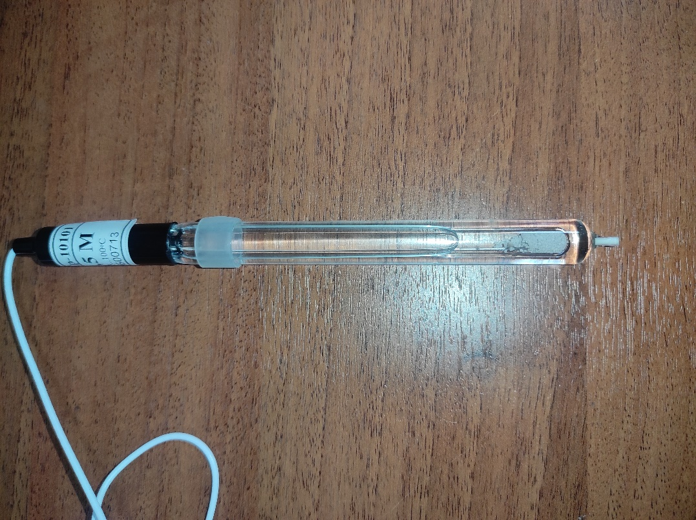

Датчик ионов 
------------

При определении состава какого-либо раствора можно прибегнуть к химическому методу, где в зависимости от внешних признаков, возникших после реакции, определяется количественный и качественный состав. Но также можно применить ``датчик ионов``, который не только будет реагировать только на определённые ионы, но и определять количественное содержание. 

Устройство датчика
~~~~~~~~~~~~~~~~~~

Датчик состоит из ионоселективного и токоотводящего электродов. 

Важнейшей составной частью ионообменных электродов является ``полупроницаемая мембрана``, которая представляет собой тонкую пленку, отделяющую внутреннюю часть ``электрода`` (где находится вспомогательный, внутренний раствор) от ``анализируемого раствора``. Мембрана называется полупроницаемой, потому что обеспечивает прохождение через неё ионов одного знака (катионов или анионов), и, преимущественно, ионов одного сорта в присутствии других ионов с тем же знаком заряда. Это обеспечивает достаточно высокую селективность мембраны.

Внутри электрода находится раствор с постоянной концентрацией тех ионов, на проверку которых рассчитан датчик. Мембрана к ним селективна. Также в растворе содержаться ионы, обеспечивающие ``потенциал вспомогательного токоотводящего электрода``. 

.. figure:: images/13.jpeg
       :width: 45%
       :align: center
       :alt: Датчик ионов 

Мембраны изготавливают из различных материалов, а классифицируют по их агрегатному состоянию: ``твердые``, ``жидкие`` и ``газочувствительные``. 

Твердые мембраны изготавливают из малорастворимого кристаллического вещества с ионным характером проводимости. Селективность твердых кристаллических мембранных электродов обусловлена вакансионным механизмом переноса заряда. Вакансии заполняются только определенными подвижными ионами в соответствии с их характеристиками (форма, размер, распределение заряда вакансии).

В настоящее время электроды с твердыми кристаллическими мембранами изготавливают и без внутреннего раствора, используя прямой контакт металлического проводника и мембраны. Такие электроды называют твердотельными (или электродами с твердым контактом), они значительно удобнее в работе, чем электроды с внутренними растворами.

Жидкая мембрана — это слой жидкого органического вещества, которое не должно растворяться в исследуемом растворе. Устойчивость мембраны повышается, если органическая жидкость обладает ещё и ``высокой вязкостью``.

Система газового электрода включает ионоселективный электрод и электрод сравнения, контактирующие с небольшим объемом вспомогательного (приэлектродного) раствора. Этот раствор отделен от исследуемого раствора прослойкой или гидрофобной газопроницаемой мембраной.

Электродом сравнения может быть ``электрод II рода`` в растворе электролита с анионом малорастворимой соли.

Потенциал электрода сравнения служит точкой отсчета, по отношению к которой измеряют потенциал индикаторного (ионоселективного) электрода. Но и индикаторный электрод, в принципе, может служить также и электродом сравнения, если создать условия, при которых потенциал такого индикаторного электрода остается неизменным в процессе анализа.

Универсальным электродом сравнения является стандартный ``водородный электрод``, но для практической работы он неудобен из-за необходимости использования очень чистого водорода и ряда других причин.

       Сравнительный электрод комплекта PolusLab

Принцип работы
~~~~~~~~~~~~~~

Рассмотрим пример при детектировании катиона кальция.

Если полупроницаемую мембрану поместить между двумя растворами с разными концентрациями определяемого катиона К :sup:`+` :sub:`1`, то на внешней и внутренней поверхностях мембраны будет происходить обмен этими катионами как в прямом, так и в обратном направлениях, т.е. катионы из раствора будут проникать в фазу мембраны и обратно (для других катионов, например, K :sup:`+` :sub:`2`, и анионов А :sup:`-` мембрана непроницаема). На Рис.3 представлено схематическое изображение мембранной ячейки, являющейся частью мембранного ионоселективного электрода.

+----------------------------------------------------+-------------------------------------------------+
| .. figure:: images/15.png                          | 1 – мембрана                                    |
|        :width: 60%                                 |                                                 |
|                                                    | 2 - внешний (анализируемый) раствор             |
|                                                    |                                                 |
|                                                    | 3, 4 – внешний и внутренний электроды сравнения |
|                                                    |                                                 |
| Рис.3. Схематическое изображение мембранной ячейки | 5 – внутренний (стандартный) раствор            |
|                                                    |                                                 |                             
|                                                    |                                                 |                         
+----------------------------------------------------+-------------------------------------------------+

Различие в концентрации ионов в обоих растворах определяет скорость обмена. Если концентрации различны, то в растворе и в фазе мембраны возникают потенциалы на обеих поверхностях мембраны.

Через какое-то время устанавливается динамическое равновесие. Так как концентрация внутри электрода не меняется, то возникающая разница потенциалов зависит только от концентрации исследуемого раствора.

Суть процесса практически такой же независимо от используемой в ионоселективном электроде мембраны. 

.. raw:: html

    

        <iframe src="https://www.youtube.com/embed/Ss-bAm1y380?si=CuUPlJGohRbBrYL8" frameborder="0" allowfullscreen style="position: absolute; top: 0; left: 0; width: 100%; height: 100%;"></iframe>
    

