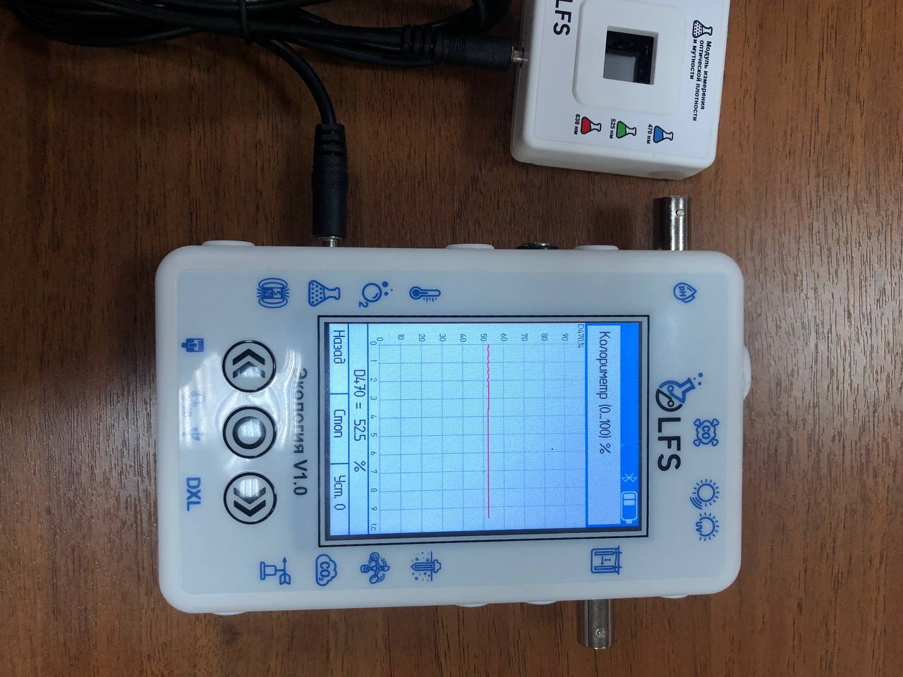

Модуль измерения оптической плотности и мутности
------------------------------------------------

Измерения оптической плотности и мутности имеют решающее значение в различных научных, промышленных и экологических приложениях. Целью этого отчета является обсуждение разработки и функциональности модуля, разработанного специально для точных и точных измерений оптической плотности и мутности. Модуль использует передовые методы оптического измерения для определения концентрации частиц в образце. В отчете представлен обзор принципов, лежащих в основе измерений оптической плотности и мутности, объяснение конструкции модуля и механизма работы, его потенциальных применений, а также обсуждение его преимуществ и ограничений.

.. figure:: images/17.png
       :width: 45%
       :align: center
       :alt: Модуль измерения оптической плотности и мутности

Принципы измерения оптической плотности и мутности:
~~~~~~~~~~~~~~~~~~~~~~~~~~~~~~~~~~~~~~~~~~~~~~~~~~~

Оптическая плотность относится к мере поглощения света образцом, а мутность представляет собой рассеяние света из-за присутствия частиц в образце. Оба измерения важны для характеристики концентрации и качества взвешенных частиц. Оптическую плотность обычно измеряют с помощью спектрофотометрии, а мутность определяют путем оценки интенсивности рассеянного света 

Конструкция и рабочий механизм модуля:
~~~~~~~~~~~~~~~~~~~~~~~~~~~~~~~~~~~~~~

Модуль измерения оптической плотности и мутности состоит из оптического датчика, источника света, камеры для проб и системы сбора данных. Источник света излучает луч света, который проходит через камеру для образца, содержащую жидкий образец. Оптический датчик обнаруживает либо поглощенный свет для измерения оптической плотности, либо рассеянный свет для измерения мутности. Система сбора данных записывает обнаруженную интенсивность света и преобразует ее в соответствующие значения оптической плотности или мутности.

Применение модуля:
~~~~~~~~~~~~~~~~~~

Модуль измерения оптической плотности и мутности находит применение в самых разных отраслях промышленности и научных исследованиях. Приложения для мониторинга окружающей среды включают оценку качества воды, обнаружение загрязняющих веществ и анализ присутствия взвешенных твердых частиц. Кроме того, пищевая промышленность и производство напитков полагаются на этот модуль для обеспечения качества в ходе производственных процессов.

.. raw:: html

    

        <iframe src="https://www.youtube.com/embed/uE81heVUkJg?si=99s29Rt9NGiQJt7S" frameborder="0" allowfullscreen style="position: absolute; top: 0; left: 0; width: 100%; height: 100%;"></iframe>
    

