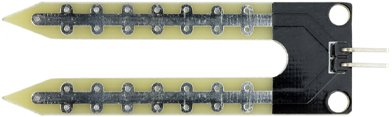
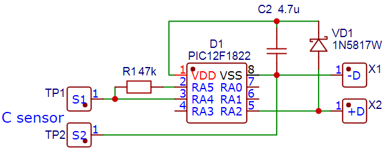
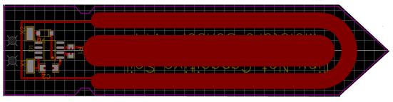

Датчик влажности почвы
----------------------

Влажность почвы характеризуется количеством воды, содержащейся в почве в момент определения. Различают влажность ``абсолютную`` и ``относительную``.

Абсолютной влажностью называется содержание воды в процентах к массе (весу) или объему сухой почвы. Для определения абсолютной влажности навеску почвы высушивают до постоянной массы и рассчитывают по формуле: М :sub:`m` = М :sub:`в` / М :sub:`п` ⋅ 100%, где

- М :sub:`m` - абсолютная массовая влажность в процентах;

- М :sub:`в` - масса воды в образце;

- М :sub:`п` - масса сухой почвы;

- 100 - коэффициент для расчета в процентах

Относительная влажность — это отношение содержания влаги в данный момент к количеству воды, насыщающей почву до её наименьшей влагоемкости. Относительная влажность рассчитывается по формуле: W :sub:`отн` = W :sub:`абс` ⋅ 100% / НВ, где

- W :sub:`отн` - относительная влажность;
- W :sub:`абс` - абсолютная влажность;
- НВ - наименьшая влагоемкость;
- 100 - коэффициент для расчета в процентах.

Относительная влажность характеризует степень насыщенности почвы водой по сравнению с пористостью или наименьшей влагоемкостью.

Устройство датчика влажности почвы
~~~~~~~~~~~~~~~~~~~~~~~~~~~~~~~~~~

Широкое распространение получили два типа датчиков: ``резистивный`` и ``ёмкостной``

**Резистивный**

Резистивный датчик имеет простейшее устройство ``в виде вилки`` двух незамкнутых друг на друга контактов. Он погружается в почву, где влага замыкает цепь, и по ней начинает течь ток. Значение тока будет зависеть от проводимости почвы, а проводимость от относительной влажности. 

Такой датчик очень дешев и прост в использовании и устройстве, однако, открытые контакты подвержены эрозии не только со стороны агрессивной среды, но и процесса электролиза. 

Ускоренное старение контактов приводит не только к скорому выводу из строй датчика, но и быстро сбивает калибровку в процессе эксплуатации.

**Ёмкостный**

Устройство этого датчика несколько сложнее. Он представляет из себя

Конденсатор необычной формы, обкладки которого расположены в текстолитовой пластинке, что обеспечивает защиту от агрессивной химической среды.

  

Принцип измерения основан на заряде ёмкости через резистор с фиксированным сопротивлением, срабатывании компаратора по достижению заданного значения и измерении длительности импульса на выходе компаратора.

В качестве источника заряда измеряемой емкости используется напряжение питания, а порог срабатывания компаратора формируется из того же напряжения резисторным делителем. Таким образом, изменение напряжения питания не влияет на точность измерения емкости

Рассмотрим датчик влажности почвы, входящий в состав комплекта цифровой лаборатории.

Очевидно, что он ёмкостного вида. Погружаемая в почву часть выполнена из текстолита, внутри которого можно разглядеть обкладки конденсатора. На ней есть линия, до которой датчик должен быть введен, чтобы изменить диэлектрическую проницаемость среды на всей площади взаимодействия обкладок.

Работоспособность устройства можно проверить, взяв его в руки. Это изменить проводимость внешней среды, что тут же можно будет увидеть на экране блока управления.

.. figure:: images/24.jpg
       :width: 45%
       :align: center
       :alt: Устройство датчика влажности почвы

.. raw:: html

    

        <iframe src="https://www.youtube.com/embed/hzf_bbETOKk?si=rgpmEgK6zY6jB0rB" frameborder="0" allowfullscreen style="position: absolute; top: 0; left: 0; width: 100%; height: 100%;"></iframe>
    

