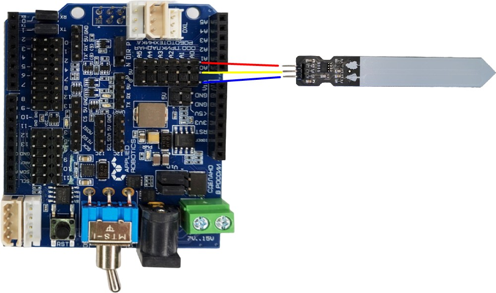
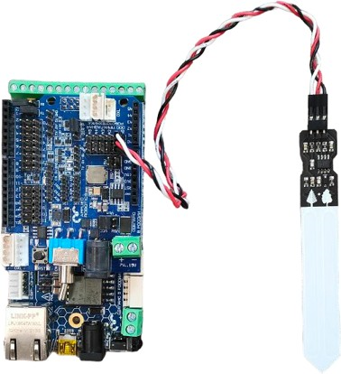
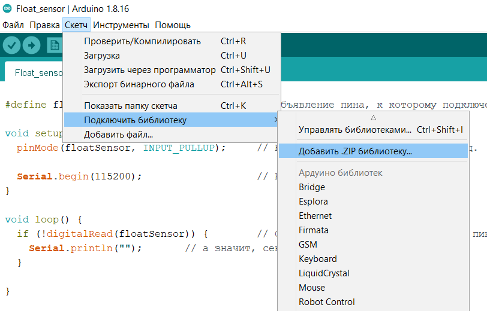
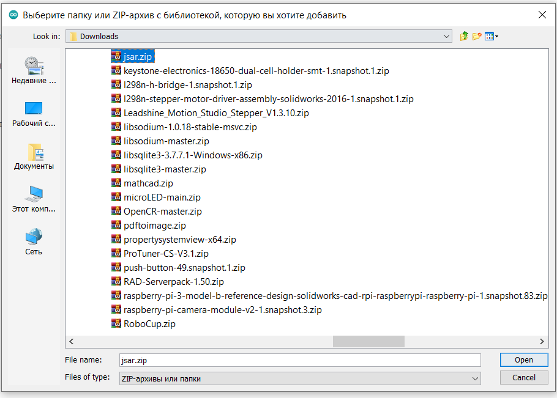

Тема 3: Датчик влажности почвы + PolysLab
=========================================
Задание: разобрать принцип работы датчика влажности почвы.

Принцип работы
--------------
Датчик для измерения влажности почвы выполнен в виде вилки с двумя электродами, которыми погружается в грунт на расстояние до 40 мм. При подключении питания на электродах создаёться напряжение. Если почва сухая, её сопротивление велико и через датчик между электродами течёт слабый ток. Если земля влажная — её сопротивление становится меньше, а ток датчика между электродами соответственно увеличивается. По итоговому аналоговому сигналу можно судить о степени увлажнения почвы.

Максимальное напряжение на выходе S не превышает 75% от напряжения питания модуля V, т.е. сигнальный диапазон датчика равен:

::
  0–3,5 В при питании 5 В
  0–2 В при питании 3,3 В.

На показания датчика также влияют следующие факторы:

::
    Степень погружения датчика в почву.
    Тип почвы, её химические и физические свойства.
    Наличие и количество примесей в воде.

Электроды датчика покрыты золотом, чтобы предотвратить пассивную коррозию, когда он выключен. Избавиться от электролитической коррозии, вызванной протекающим током, невозможно, поэтому сенсор резистивного типа рекомендуется запитывать через силовой ключ. То есть, включать его только на время измерений, чтобы максимально продлить ресурс. В плане эксплуатации это доставляет неудобство, поэтому рекомендуем обратить внимания на ёмкостный датчик влажности почвы, который в силу своего исполнения не подвержен коррозии.
Датчик влажности почвы является аналоговым датчиком и подключается через блок аналоговых устройств (23) на плате расширения (Рисунок 29). На экран можно выводить показания, считываемые датчиком. На рисунке 30 показано подключение в живую.

       Рисунок 29

       Рисунок 30
Чтобы поставить библиотеку для работы с платой, необходимо скачать архив с библиотекой jsar.zip по ссылке 
::
  https://appliedrobotics.ru/?page_id=633
Далее требуется открыть Arduino IDE, перейти во вкладку Скетч -> подключить библиотеку -> Добавить zip библиотеку.

       

Далее необходимо выбрать архив с библиотекой

       

И нажать кнопку Open. После успешной установки библиотеки в нижней части интерфейса программы появится сообщение.

       

Задание: вывести на экран показания с датчика влажности почвы.
Решение: внизу находится код для вывода показателей на монитор компьютера. 

Данный код пишется в программе на языке С в Arduino IDE 
::
  #include <JsAr.h>   // Подключение библиотеки для работы с платой ESP.
   
  void setup() {
    JsAr.begin();   // Начинаем работу с платой ESP. Без этой строчки ничего работать не будет!
    pinMode(A0, INPUT);     // Устанавливаем пин A0 как вход. Serial.begin(115200); // Начинаем общение по сериал-порту.
  }
   
  void loop() {
    int tempData = analogRead(A0);  // Считываем аналоговый сигнал.
    int intData = map(tempData, 0, 2048, 0, 100);   // Преобразовываем сигнал из некоторых условных единиц в проценты.
    String stringData = String(intData);        // Преобразовываем данные в строку. Serial.println(stringData); // Выводим в сериал-порт.
    delay(100);
  }

