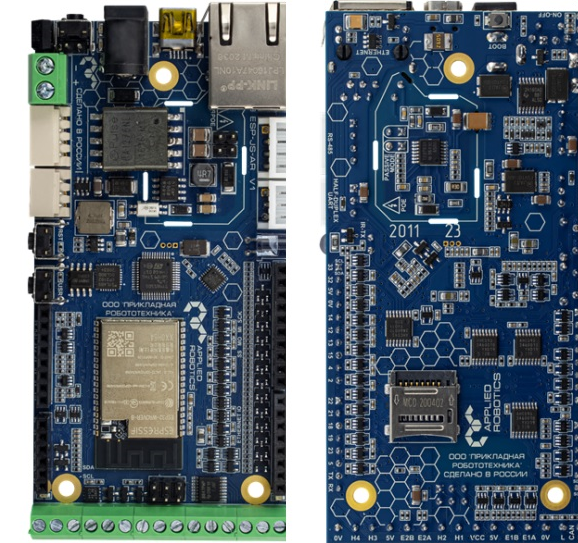
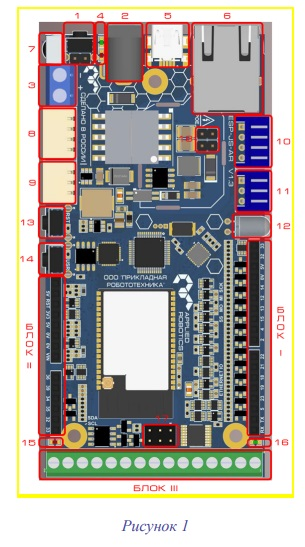
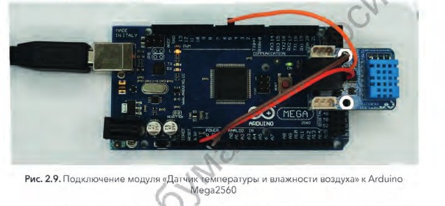
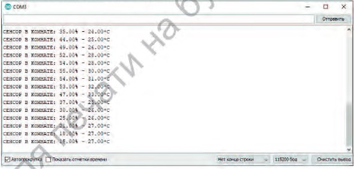
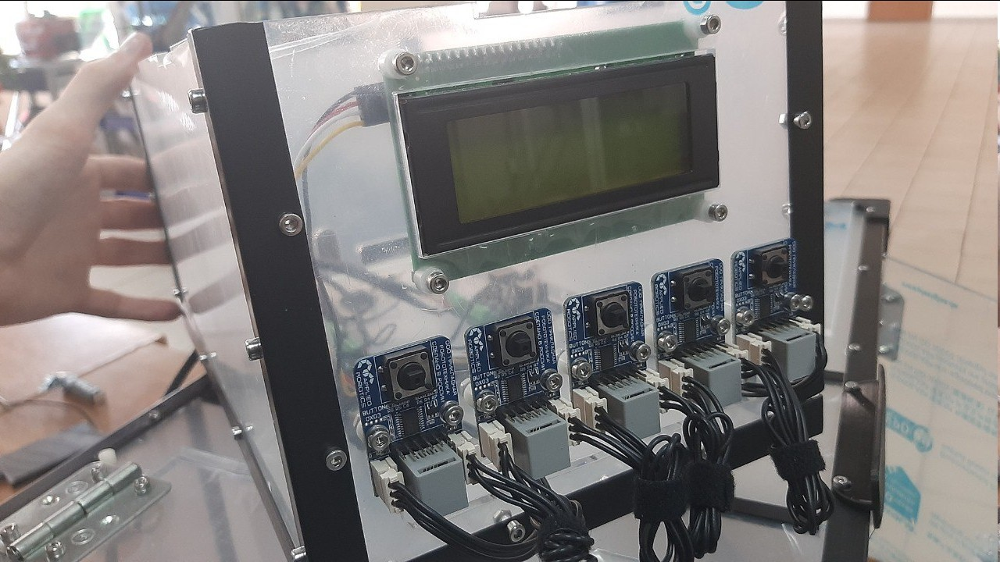

Подробный обзор конструкции блока
=================================
На данный момент мы переходим к тематике подробного описания блока. Блок – отдельная часть конструкции умной теплицы, содержащая ``управляющие элементы``, ``информационную панель`` и ``датчик температуры``. 

Геометрические характеристики   
-----------------------------
Блок размещается над корпусом теплицы, между дверцами. 
::
  Ширина: 180 мм
  Длина: 340 мм
  Высота: 155 мм
Блок выполнен из панелей матового оргстекла толщиной 5 мм с технологическими отверстиями, соединённых металлическими уголками. 

Микроконтроллер
---------------

 
На проекте «Agrolab_GH» используется плата ESP-JS-AR.

Помимо возможности подключения различных периферийных модулей контроллер ESP-JS-AR обладает возможностью подключения и управления исполнительными механизмами – двигателями постоянного тока и сервоприводами. Для этого на его борту располагается 2 блока клемников для подключения классических двигателей постоянного тока. 

Так же предусмотрена возможность подключения как квадратурных (до 2х штук), так и инкрементных (до 4х штук) энкодеров. Кроме обычных двигателей постоянного тока контроллер может управлять двигателями по интерфейсу CAN. Из специфических интерфейсов контроллер обладает интерфейсами RS485 и 3х пиновым полудуплексным UART, что позволяет подключать к контроллеру Dynamixel-совместимые модули – как сенсорные, так и сервоприводы. В зависимости от модификации используется либо 3х, либо 4х пиновые разъемы MOLEX или JST.

Для беспроводного обмена данными на контроллере имеются как классические интерфейсы – WiFi и Bluetooth, реализованные в центральном модуле контроллера –ESP32 WROVER’е, так и модули для приема и передачи данных в ИК-диапазоне на частоте в 38 Кгц Питание контроллера может быть осуществлено следующими способами: от 5В через miniUSB разъем. Однако в данном случае часть функционала контроллера будет недоступна (из за ограниченности отдачи тока по шине USB). Более того, в ряде случае контроллер от питания через USB вообще не будет функционировать. 

Поэтому совместно с подключением по USB рекомендуется использовать дополнительное внешнее питание - От Ethernet разъема, используя технологию POE. 

Расположение значимых элементов изображено на схеме 

Электронные функциональные модули
---------------------------------
Блок содержит несколько модулей (датчиков, плат, ключей, кнопок, дисплеев, светодиодов) соединённых проводами и закреплённых на корпусе блока. Список модулей:

Светодиод
---------

.. |pic1| image:: images/5.png
   :width: 45%

.. |pic2| image:: images/6.png
   :width: 32%

|pic1| |pic2|

Модуль “Светодиод” имеет:

``Разъём DXL`` - два трёхпиновых разъёма типа Molex, содержащих в себе линии GND (земля), VCC (питание), DATA (линия данных). Используются для подключения модуля по интерфейсу Dynamixel, как в одиночном виде, так и в составе цепи устройств.

``Разъём типа RJ14`` для подключения модуля в фирменную плату расширения для подключения сенсорных модулей.

``Шестипиновый разъём``, содержащий следующие линии:

``VCC``- линия питания, на которую можно подать напряжение в диапазоне от 5В до 12В;

``NC`` - неиспользуемая линия;

``5V`` - линия питания, на которую можно подать напряжение 3.3В или 5В. При подаче напряжения питание 3.3В необходимо следить, чтобы на линиях VCC отсутствовало напряжение;

``EN`` - сигнальная линия;

``NC`` - неиспользуемая линия;

``GND`` - линия земли;

``Светодиод`` - одноцветный источник излучения.

Датчик влажности
----------------

Модуль ``Датчик влажности воздуха и температуры`` построен на базе сенсора DHT11, способного определять температуру и влажность окружающей среды в области около нормальных климатических условий (при температуре от 0 до 50 градусов и влажности от 20 до 90%).
Подключение модуля к ``Arduino Mega2560`` выполняется в соответствии с распиновкой разъёма. Таким образом, линию модуля 5В подключим к линии 5В Mega2560, лини. GND - к GND Mega2560, а линию управления SIG - к цифровой линии 5. В результате, внешний вид подключённого модуля будет выглядеть, как на рисунке:

.. |pic4| image:: images/8.png
   :width: 39%

|pic3| |pic4|

Поскольку данный модуль имеет униикальный протокол обмена данными, подобный 1-Wire, для работы с ним рекомендуется использовать подходящую библиотеку. Таких библиотек существует достаточно много, но в данном примере воспользуемся библиотекой ``iarduino_DHT``
::
  #include <iarduino_DHT.h> // Подключаем библиотеку для работы с датчиком DHT
  iarduino_DHT sensor(5);   // Объявляем объект, указывая номер вывода, к которому подключён модуль
  void setup(){
    Serial.begin(115200);     // Инициируем передачу данных в монитор последовательного порта, на скорости 115200 бод
    delay(1000);            // Приостанавливаем выполнение скетча на 1 секунду, для перехода датчика в активное состояние
  }
  void loop(){                 Serial.print  ("CEHCOP B KOMHATE: ");
    switch(sensor.read()){  // Читаем показания датчика
      case DHT_OK:             Serial.println((String) sensor.hum + "% - " + sensor.tem + "*C"); break;
      case DHT_ERROR_CHECKSUM: Serial.println("HE PABEHCTBO KC");                                break;
      case DHT_ERROR_DATA:     Serial.println("OTBET HE COOTBETCTB. CEHCOPAM 'DHT'");            break;
      case DHT_ERROR_NO_REPLY: Serial.println("HET OTBETA");                                     break;
      default:                 Serial.println("ERROR");                                          break;
    } delay(2000);          // Приостанавливаем выполнение скетча на 2 секунд, между выводами показаний
  }
В результате, загрузив данный код в контроллер стандартным способом и открыв монитор порта, можно увидеть следующие данные:

LED-дисплей
-----------

``LED-дисплей`` (светодиодный дисплей) представляет собой вид дисплея, который использует светодиоды (Light-Emitting Diodes) в качестве источника света. Он состоит из множества светодиодов, сгруппированных в матрицу или сегменты.
В данном блоке используется ``четырёхсегментный LED-дисплей``.

Тактовые кнопки (5 штук) 
------------------------

Модуль ``Тактовая кнопка``, по своей сути, является обычной тактовой кнопкой, размещенной на плате с микроконтроллером, Данный модуль предполагается использовать для более удобного подключения кнопок к популярным микроконтроллерам.
Внешний вид представлен на изображении LED-дисплея под дисплеем.

.. figure:: images/11.png
       :scale: 100 %
       :align: center
       :alt: кнопка

Кроме того, в конструкции предусмотрены ``релейные модули`` и ``модули силового ключа`` (4 штуки) для управления напряжением на управляющей плате.

Позиционирование блока на теплице
---------------------------------

.. figure:: images/12.png
       :width: 60%
       :align: center
       :alt: Позиционирование блока на теплице
