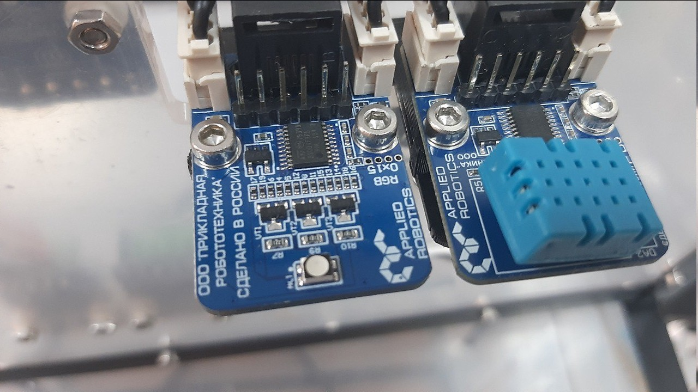
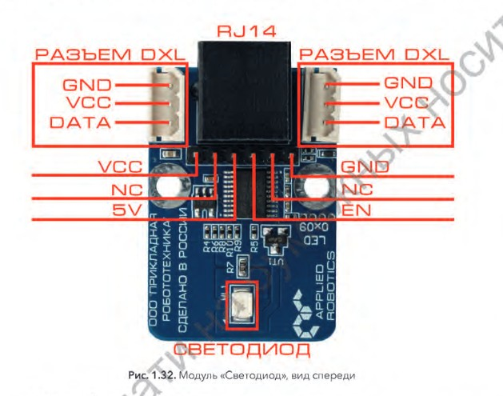

Подробный обзор конструкции блока
=================================
На данный момент мы переходим к тематике подробного описания блока. Блок – отдельная часть конструкции умной теплицы, содержащая ``управляющие элементы``, ``информационную панель`` и ``датчик температуры``. 

Геометрические характеристики   
-----------------------------
Блок размещается над корпусом теплицы, между дверцами. 
::
  Ширина: 180 мм
  Длина: 340 мм
  Высота: 155 мм
Блок выполнен из панелей матового оргстекла толщиной 5 мм с технологическими отверстиями, соединённых металлическими уголками. 
Электронные функциональные модули
---------------------------------
Блок содержит несколько модулей (датчиков, плат, ключей, кнопок, дисплеев, светодиодов) соединённых проводами и закреплённых на корпусе блока.
Список модулей:
    * Светодиод

