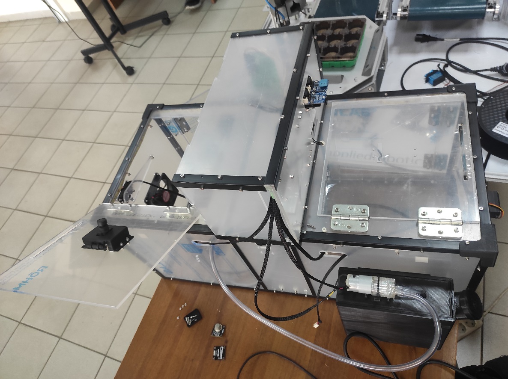
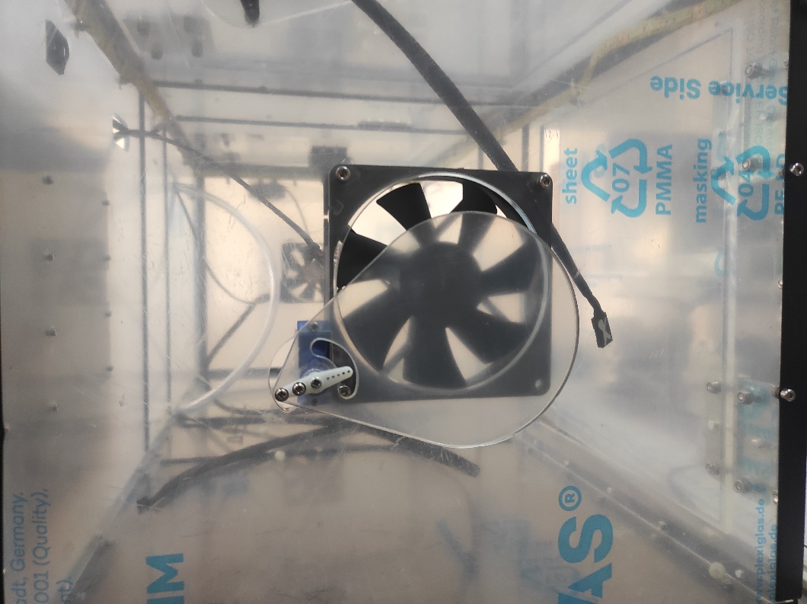

Подробный обзор конструкции корпуса автоматической теплицы
==========================================================
Введение
--------
Теплица – автономный или отапливаемый парник для круглогодичного или внесезонного выращивания тепличных культур и рассады, представляющий собой сооружение защищенного грунта со светопроницаемым куполом. В теплице образуется постоянная атмосфера с, по возможности, настраиваемыми параметрами внутренней среды. На здоровье растений в значительной мере влияют многие факторы, как например: ``влажность воздуха``, ``кислотность``, ``влажность и солевой баланс почвы``, ``содержание кислорода``, ``диоксида углерода в атмосфере``, ``интенсивность солнечного излучения`` и тп. Часто за этим всем приходится следить человеку, однако, большую часть работы может взять на себя автоматизированная система.

Для эффективного климат контроля такое сооружение необходимо снабдить ``датчиками``, показания которых будут влиять на дальнейшее “поведение” теплицы. 

       Рис.1. Разрабатываемая автоматическая теплица 
Конструкция теплицы
-------------------
Теплица представляет из себя прямоугольный короб 35*33*73см, выполненный из оргстекла (Рис.1). Механическую часть представляют ``два вентилятора`` (Рис.2), по одному на каждой из малых гранях. Они обеспечивают принудительный продув, а за контроль поток отвечают ``два сервопривода``, контролирующие крышки на вентиляторах. 

       Рис.2. Вентилятор и сервопривод
Еще ``два сервопривода`` поднимают два квадратных горизонтальных прозрачных люка 24.5*27 см (Рис.3), находящихся сверху на крышке и примыкающих к ребрам, смежным с крышкой и малыми гранями. Передача движения осуществляется через незакрепленный на люке рычаг, что позволяет без риска повреждения конструкции открыть люк вручную в любой момент. Данный элемент конструкции даёт возможность осуществлять контролируемый естественный воздухообмен с внешней атмосферой.